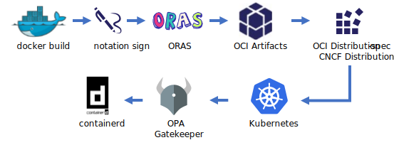

# Notary Project Overview

A current overview of Notary v2, including a collection of requirements & scenarios, framing the scope of the Notary v2 project.

## Project Status

The Notary v2 project is in early development and design documents should not be considered final. Please refer to the [milestones](https://github.com/notaryproject/notaryproject/milestones) or [attend](#contributing-&-conversations) the weekly meetings for details on the roadmap.

## TOC

- [Overview](#notary-v2-overview)
- [Notary v2 Journey](#the-notary-v2-journey)
- [Top Areas of Focus](#top-areas-of-focus)
- [Stages of Development](#stages-of-development)
- [Notary v2 February 2021 Status](./status-updates/notary-status-2021-02.md)

Additional details for Notary v2 efforts:

- [Goals & Requirements][nv2-requirements]
- [Scenarios][nv2-scenarios]
- [Threat Model][nv2-threat-model]
- [Definitions & Terms][nv2-definitions]
- [Contributing](#contributing-&-conversations)

## Notary v2 Overview


Notary v2 provides for multiple signatures of an [OCI Artifact][oci-artifacts] (including container images) to be persisted in an [OCI conformant][oci-distribution-conformance] registry. Artifacts are signed (`nv2 sign`) with private keys, and validated with public keys (`nv2 verify`). To support user deployment flows, signing an OCI Artifact will not change the `@digest` or `artifact:tag` reference. To support content movement across multiple certification boundaries, artifacts and their signatures will be easily copied within and across [OCI conformant][oci-distribution-conformance] registries.



To deliver on the Notary v2 goals of cross registry movement of artifacts with their signatures, changes to several projects are anticipated, including [OCI distribution-spec][oci-distribution-spec], [CNCF Distribution][cncf-distribution], [OCI Artifacts][oci-artifacts], [ORAS][oras] with further consumption from projects including [containerd][containerd], [OPA][opa], [Gatekeeper][gatekeeper] and the [docker client][docker-client].

Notary v2 aims to solve the intra and cross registry signing & validating scenarios through the following prototypical experiences:

**Docker build, sign, push, pull, verify**:

```bash
docker build -t registry.wabbit-networks.io/net-monitor:v1 .

nv2 sign \
  -k wabbit-networks.key \
  -r registry.wabbit-networks.io/net-monitor:v1

docker push registry.wabbit-networks.io/net-monitor:v1
```

On another node, verify the signature before deployment. 

_**Note**: the `nv2 verify` command is shown external to the docker client to demonstrate validation, which may be added to any container runtime, including containerd._

```bash
nv2 verify \
  -k wabbit-networks.key \
  -r registry.wabbit-networks.io/net-monitor:v1

docker run registry.wabbit-networks.io/net-monitor:v1
```

**Copy a container image, with it's signatures across two registries with the existing docker tool chain**:

```bash
docker pull registry.wabbit-networks.io/net-monitor:v1

docker tag registry.wabbit-networks.io/net-monitor:v1 \
  registry.acme-rockets.io/net-monitor:v1

docker push registry.acme-rockets.io/net-monitor:v1
```

**Copy a container image to a private registry, verifying the source then adding a verification signature**:

```bash
nv2 verify \
  -k wabbit-networks.key \
  -r registry.wabbit-networks.io/net-monitor:v1

docker pull registry.wabbit-networks.io/net-monitor:v1

# run one or more verification processes, then sign with the ACME Rockets key

docker tag registry.wabbit-networks.io/net-monitor:v1 \
  registry.acme-rockets.io/net-monitor:v1

nv2 sign \
  -k acme-rockets.key \
  -r registry.acme-rockets.io/net-monitor:v1

docker push registry.acme-rockets.io/net-monitor:v1
```

## The Notary v2 Journey

Notary v2 [kicked off in December of 2019][notaryv2-kickoff] with a [broad range of attendees][kickoff-attendees]. The effort defined success goals, including adoption by all major vendors & projects, enabling content to be signed and flow within and across [OCI distribution-spec conformant][oci-distribution-conformance] registries. Throughout 2020, the group agreed upon a set of [Notary v2 requirements][nv2-requirements] and [scenarios][nv2-scenarios] enabling spec and design conversations to be grounded in a set of [goals][nv2-requirements] and [non-goals][non-requirements]. Prototypes, based on the requirements have started, focusing on the primary areas on innovations.

## Top Areas of Focus

To complete Notary v2, three key areas of focus were identified:

1. [Definition of a Notary v2 Signature](#definition-of-a-notary-v2-signature)
1. [Registry Persistance, Discovery and Retrieval](#registry-persistance-discovery-and-retrieval)
1. [Key Management](#key-management)

### Definition of a Notary v2 Signature

A Notary v2 signature would attest to the digest of an artifact, associating it with a signing key.

### Registry Persistance, Discovery and Retrieval

An artifact must be capable of being pushed to a registry, with a signature being added independently from the artifact. This enables the originating author of the content to sign the artifact, and subsequent entities to add additional signatures, attesting to its validity as they determine.

The Notary v2 workflow ([outlined in Scenario #0](https://github.com/notaryproject/requirements/blob/main/scenarios.md#scenario-0-build-publish-consume-enforce-policy-deploy)) enables Wabbit Networks to sign their `net-monitor` software. Docker Hub may endorse Wabbit Networks software, providing an aggregator certification by adding a Docker Hub signature. This would allow customers like ACME Rockets to not necessarily know of small vendors like Wabbit Networks, but allow the ACME Rockets engineering team to pull Docker Certified content. As ACME Rockets imports the content, scans and validates it meets their requirements, they add an additional ACME Rockets signature, which must exist for any production usage within the ACME Rockets environment.

#### Registry Persistance and Retrieval

Registry persistance and retrieval are defined through the [OCI distribution-spec][oci-distribution-spec], with [OCI Artifacts][oci-artifacts] capabilities to store non-container images. No additional changes are known at this time.

#### Registry Discovery

Registry discovery of linked artifacts enables finding a signature, based on the target artifact. In the Notary v2 example, the ACME Rockets production servers must be capable of efficiently finding the ACME Rockets signature for the `net-monitor:v1` image. Once the signature is identified, through a content addressable digest, the Notary v2 client may validate the signature.

### Key Management

Key Management involves the following key scenarios:

- Signing with private keys
- Publishing and discovery of public keys for consumers to validate signatures
- Key revocation, including support for air-gapped environments

Private key management is beyond the scope of the Notary v2 effort, as companies have well defined practices that are internal to their software development.

Publishing and discovery of public keys should be easy for consumers to acquire, however, Notary v2 will not implicitly support a **T**rust **o**n **F**irst **U**se (TOFU) model.

Key revocation must support air-gap environments, enabling users to validate keys when resources inside a network isolated environment are unable to reach public endpoints.

## Stages of Development

To deliver Notary v2, we recognized the need of experts from multiple backgrounds, experiences and skill sets. The various perspectives were needed to assure we learned from past efforts and learned from subject matter experts.

As subject matter experts converged, we found it difficult for the various SMEs to understand other components of the end to end workflow. The typical Open Source model for authoring specs involves “writing it down”. Contributors Create a pull request on some markdown so all can review. However, we learned _The problem isn’t in the writing, it’s in the reading._

To facilitate better communications across the skill sets, respecting everyone's time, we recognized the need to invest in models and prototypes. We followed the design patterns of other large, complex projects like Antoni Gaudí's design of [The Sagrada Famila](https://simple.wikipedia.org/wiki/Sagrada_Fam%C3%ADlia). The [sketch, prototype, build approach](https://stevelasker.blog/2020/07/31/sketch-prototype-build/) would enable the various experts to focus on their component, while understanding where they plug-into other components of the design.

As a result, we identified the following stages of the Notary v2 effort:

1. Define Requirements
1. Build Prototypes
1. Validate prototypes - learning, refining requirements, iterating prototypes
1. Author a Notary v2 Spec

Throughout the Notary v2 effort, updates to the stages of development and areas of focus will be detailed.

- [2021 - February Status Update](./status-updates/notary-status-2021-02.md)

## Contributing & Conversations

Regular conversations for Notary v2 occur on the [Cloud Native Computing Slack](https://app.slack.com/client/T08PSQ7BQ/CQUH8U287?) channel.

Weekly meetings occur each Monday. Please see the [CNCF Calendar](https://www.cncf.io/community/calendar/) for details.

Meeting notes are captured on [hackmd.io](https://hackmd.io/_vrqBGAOSUC_VWvFzWruZw).

[cncf-distribution]:            https://github.com/distribution/distribution  
[containerd]:                   https://github.com/containerd
[docker-client]:                https://www.docker.com/products/docker-desktop
[gatekeeper]:                   https://github.com/open-policy-agent/gatekeeper
[kickoff-attendees]:            https://github.com/notaryproject/meeting-notes/blob/main/meeting-notes-2019.md#attendees
[moby]:                         https://github.com/moby
[notaryv2-kickoff]:             https://github.com/notaryproject/meeting-notes/blob/main/meeting-notes-2019.md#notary-v2-kickoff-meeting
[non-requirements]:             ./requirements.md#non-goals
[nv2-notes]:                    https://hackmd.io/_vrqBGAOSUC_VWvFzWruZw
[nv2-requirements]:             ./requirements.md
[nv2-scenarios]:                ./scenarios.md
[nv2-signature-spec]:           https://github.com/notaryproject/nv2/tree/prototype-1/docs/signature
[nv2-threat-model]:             ./threatmodel.md
[nv2-key-management]:           https://github.com/notaryproject/requirements/pull/38/
[nv2-distribution-spec]:        https://github.com/opencontainers/artifacts/pull/29
[nv2-definitions]:              ./definitions-terms.md
[oci-artifacts]:                https://github.com/opencontainers/artifacts
[oci-artifact-manifest]:        https://github.com/opencontainers/artifacts/pull/29
[oci-distribution-spec]:        https://github.com/opencontainers/distribution-spec
[oci-distribution-conformance]: https://github.com/opencontainers/oci-conformance
[opa]:                          https://github.com/open-policy-agent
[oras]:                         https://github.com/deislabs/oras
