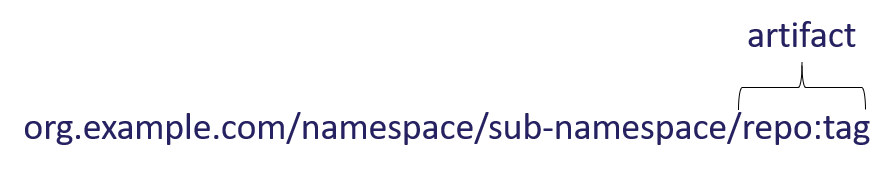
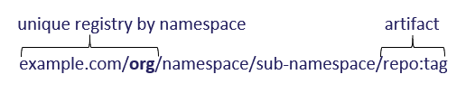

# Definitions and Terms

A collection of definitions and terms used within this repository.

## TOC

* [Fingerprint](#fingerprint)
* [Fully Qualified Artifact Reference](#registry-fully-qualified-reference)
* [Multi-Tenant Registry](#multi-tenant-registry)
* [OCI Annotations](#oci-annotations)
* [OCI Descriptor](#oci-descriptor)
* [OCI Index](#oci-index)
* [OCI Manifest](#oci-manifest)
* [Registry](#registry)
* [SBoM](#sbom)
* [Subject](#subject)
* [Tag](#tag)

## Artifact / Image

Artifacts are a generalization of how images are stored in an instance of the [OCI Distribution Spec][oci-distribution-spec]. An [OCI Image][oci-image] is a type of [OCI Artifact][oci-artifact]. When referencing artifacts, within a [fully qualified reference](#registry-fully-qualified-reference), the artifact is right most element of the namespace, combined with the `:tag`.  
Reference: [OCI Artifacts][oci-artifact]  
  

## Fingerprint

A short identifier of a given public key.  
Reference: [Fingerprint][fingerprint]

## Multi-Tenant Registry

A collection of unique [registries](#registry), stored within an instance of an [OCI Distribution Spec][oci-distribution-spec]. Registry operators use one of two methods to uniquely identify an org. In either case, information within that org is considered unique to the org, including all key references and authentication.

## OCI Annotations

A key-value map that can be associated with [OCI Descriptors][oci-descriptor] and [OCI Image manifests][oci-manifest].  
OCI spec reference: [OCI Annotations][oci-annotations]

## OCI Descriptor

A structure describing content, including the media type, a content-addressable digest, the size, and other properties. Descriptors are used to describe layers and configuration in a manifest.  
OCI spec reference: [OCI Descriptor][oci-descriptor]

## OCI Index

A higher-level collection of [image manifests][oci-manifest], or other [oci indexes][oci-index], typically used to describe platform-specific (architecture and operating-system) images that can be identified collectively and referred to together. The specific image manifests are identified by modified [descriptors][oci-descriptor] with additional properties and restrictions. [OCI Artifacts][oci-artifact] takes this a step further and provides for an OCI Index to reference a collection of artifacts, such as an image, a deployment chart, its SBoM and deployment configuration references.  
OCI spec reference: [OCI Image Index][oci-index]

## OCI Manifest

A description of an [artifact][oci-artifact] within an instance of an [OCI Distribution][oci-distribution-spec] complaint registry. The manifest references optional configuration and blobs (layers) as content-addressable references ([descriptors][oci-descriptor]).  Artifacts may be container images, helm charts or other artifact types that may be signed and stored in a registry.    
OCI spec reference: [OCI Image Manifest][oci-manifest]

## Registry

A registry is a collection of [OCI Indexes][oci-index] and [OCI Manifestes][oci-manifest] for a specific org or entity.  
A unique registry may be uniquely identified with a domain  
  
 Or a root namespace:  

## Registry Namespace

A path, within the [unique registry org](#multi-tenant-registry), up to, but not including the repository (repo) name.  

## Repo/Repository

A repo/repository refers to the unique location, within a registry. When referring to a repo, the registry is assumed, based on the context.  

## Registry: Fully Qualified Reference

In order to deploy an artifact, a fully qualified reference is required. This includes the unique registry, namespace, repo and tag.  

## SBoM

Represents a generic, non-project specific, reference to a Software Bill of Materials. Similar to the automotive industry which tracks the components that make up a vehicle, the SBoM may contain the list of packages used within the artifact, the compiler and version used to build the artifact and other relevant information.  
Additional reference: [Software bill of materials][sbom]

## Subject

The data that is signed.

## Tag

Information that represents a version, or platform specific version of the artifact. 
eg:
- `example.com/org/namespace/artifact:tag`
- `org.example.com/namespace/artifact:tag`
- `org.example.com/databases/somedb:v1` (multi-arch tag)
- `org.example.com/databases/somedb:v1-alpine` (platform specific tag)
- `org.example.com/databases/somedb:v1-windows` (platform specific tag)
- `org.example.com/databases/somedb:v1-helm` (helm chart to deploy a platform specific image)

[fingerprint]:           https://en.wikipedia.org/wiki/Public_key_fingerprint
[oci-annotations]:       https://github.com/opencontainers/image-spec/blob/master/annotations.md
[oci-artifact]:          https://github.com/opencontainers/artifacts
[oci-descriptor]:        https://github.com/opencontainers/image-spec/blob/master/descriptor.md
[oci-distribution-spec]: https://github.com/opencontainers/distribution-spec
[oci-image]:             https://github.com/opencontainers/image-spec
[oci-index]:             https://github.com/opencontainers/image-spec/blob/master/image-index.md
[oci-manifest]:          https://github.com/opencontainers/image-spec/blob/master/manifest.md
[sbom]:                  https://en.wikipedia.org/wiki/Software_bill_of_materials