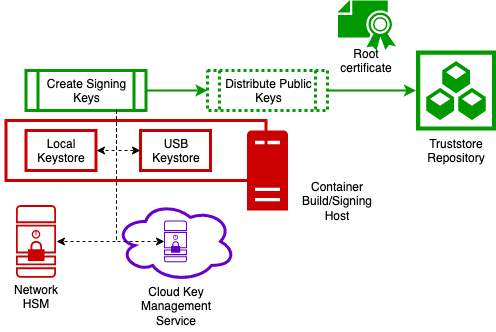
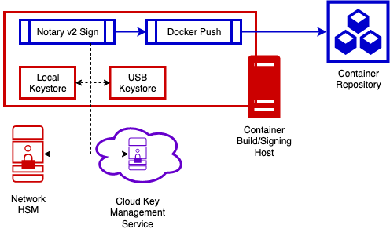
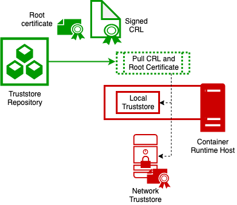
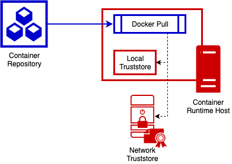
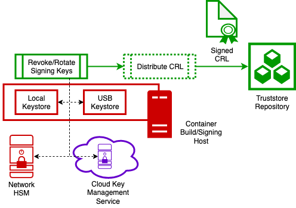

# Overview
Key management for container signing can be broadly categorized into three general use cases:
- Key Setup/Signing (How are keys set up? How are keys accessed by Notary v2 client when signatures are generated?)
- Trust store configuration (How do runtime environments determine which keys to trust?)
- Revocation (How do key owners create/revoke keys? How do runtime environments get this information?)

## Personas:
- Publisher: User who builds and signs containers.
    - Publisher Admin: In some scenarios a publisher will include a group of users (i.e. teams or enterprises). Admin users (i.e. security administrator) will be responsible for configuring roots, provide access to use or generate delegate keys, and make decisions for key revocation.
    - Publisher Builder: In some scenarios a publisher will include a group of users (i.e. teams or enterprises). Builders (i.e. developers, build hosts) will be responsible for creating artifacts. 
    - Publisher Signer: In some scenarios a publisher will include a group of users (i.e. teams or enterprises). Signers (i.e. developers, signing hosts) will be responsible for signing artifacts.
- Deployer: User who deploys containers.
    - Deployer Admin: In some scenarios a deployer will include a group of users (i.e. teams or enterprises). Admin users (i.e. security administrators) will be responsible for configuring deployment policies, including potentially a set of trusted roots or required signatures. 
    - Deployer Operator: In some scenarios a publisher will include a group of users (i.e. teams or enterprises). Operators (i.e. developers, deployment hosts) will be responsible for pulling container images from registries, verifying their signatures, and then running them.
- Repository Owner: In some scenarios a container may be stored in a repository that is managed by the repository owner. The repository may be public or private and could also be air-gapped.

## Definitions:
- Root key: A self signed key used for the lowest designation of trust. Root keys can be created by developers, organizations, public/private CAs, and registry operators. The root key should be retrieved from a trusted source that can establish the authenticity of the creator's identity.
- Signing key: A signing key is used to generate artifact signatures. A signing key should be signed with a root key or one of its intermediaries. The certificate chain with a signing key can be used to verify which root it belongs to. While a root key can be used as a signing key, this is not recommended as it creates a large blast radius and increases the risk of compromising a root key. 
- Trust Store: The trust store defines the relationship between signing keys and artifacts that are used at validation time to determine whether to trust an artifact with a crytptographically valid signature. The trust store will relate a source (any source, specific registry, specific repository, or specific target) with a certificate (for root key, intermediate, or signing key) or key repository (for automated key distribtuion). It is not recommended to use a signing key as this will cause signature validation to fail if the signing key is rotated. 
- Trust Store Certificate: The certificate in the trust store will contain:
    - Public Key: Will be matched against CRL and signature artifact.
    - Signed CRL URL: Location to retrieve CRL from.
    - Signed Identity: Identity of creator of the signed certificate.
    - (Optional) Issuer: If the certificate is an intermediate this will describe the issuer of the certificate.

## Requirements
- Signing an artifact SHOULD NOT require the publisher to perform additional actions with a registry or registry operator beyond those required to push an unsigned artifact.
- Validating a signature SHOULD NOT require the deployer to perform additional actions with a registry or registry operator beyond those required to pull an unsigned artifact.
- Moving an artifact from one repository to another SHOULD NOT invalidate the signature on the artifact.
- A rotation of the root key SHOULD NOT require the use of the existing root key.
- Publishers SHOULD be able to sign with keys stored on their local machines, secure tokens, Hardware Security Modules (HSMs), or cloud based Key Management Services.
- Publishers SHOULD be able to generate multiple signatures for a single artifact.
- Publishers MUST have a mechanism to revoke signatures to indicate they are no longer trusted. 
- Trust stores SHOULD be configurable by the deployer.
- Deployers MUST be able to configure trusted entities for individual repositories and targets.
- Deployers MUST be able to validate signatures on any version of an artifact including whether they have been revoked by the publisher.
- Signature validation MUST be enforceable in air-gapped environments with minimal updates. 

# Signing use cases:

## Provisioning Keys for Signing

## Signing Workflow

## Detailed Scenarios:
- Local Key Store
    - Publisher creates new root key on local machine. Keys are stored in key store or plain text on local machine (Need to identify keystores we want to support. We can preclude signing with root keys to improve security posture).
    - Publisher uploads root public key to registry (registry can verify user for container uploads). 
    - Publisher shares root public key (other users can verify containers before running).
    - Publisher creates new delegate keys on local machine that chain to root key (enabling only delegate keys for signing will help protect the root key).
    - Publisher runs docker build and notary v2 sign on local machine. Notary v2 client generates signatures with key in memory.
- USB Token Key Store
    - Publisher creates new root key on USB token (better security posture as key is not exposed in plain text outside of token). 
    - Publisher uploads root public key to registry (registry can verify user for container uploads). 
    - Publisher shares root public key (other users can verify containers before running).
    - Publisher creates new delegate keys on USB token that chain to root key (better security posture as key is not exposed in plain text outside of token).
    - Publisher runs docker build and notary v2 sign on local machine. Notary v2 client generates signature by submitting hash to USB Token (using a PKCS 11 interface will prevent keys from being exposed in memory).
- Network HSM
    - Publisher creates new root key on Network HSM (better security posture as key is not exposed in plain text outside of HSM). 
    - Publisher uploads root public key to registry (registry can verify user for container uploads). 
    - Publisher shares root public key (other users can verify containers before running).
    - Publisher creates new delegate keys on Network HSM that chain to root key (better security posture as key is not exposed in plain text outside of HSM).
    - Publisher runs docker build and notary v2 sign on local machine. Notary v2 client generates signature by submitting hash to Network HSM.
- Cloud Key Management Service (KMS)
    - Publisher creates new root key on Cloud KMS (better security posture as key is not exposed in plain text outside of Cloud KMS).
    - Publisher uploads root public key to registry (registry can verify user for container uploads). 
    - Publisher shares root public key (other users can verify containers before running).
    - Publisher creates new delegate keys on Cloud KMS that chain to root key (better security posture as key is not exposed in plain text outside of Cloud KMS).
    - Publisher runs docker build and notary v2 sign on local machine. Notary v2 client generates signature by submitting hash to Cloud KMS.
- Hybrid
    - Publisher Admin creates new root key on USB Token/Network HSM/Cloud Key Management Service (better security posture as key is never exposed in plain text outside of token).
    - Publisher Admin uploads root public key to registry (registry can verify user for container uploads). 
    - Publisher Admin shares root public key (other users can verify containers before running).
    - Publisher Admin provides access to Publisher Signer to create or retrieve delegate keys (admins can focus on delegating access, signers can use a portal or APIs to register keys and sign without having to repeatedly engage the admin).
    - Publisher Signer creates new delegate keys on local machine that chain to root key (the root key is not exposed to the signer).
    - Publisher Signer runs docker build and notary v2 sign on local machine. Notary v2 client generates signatures with keys on local machine.
- Signing by Build Machines
    - Publisher Admin creates new root, uploads root public key to registry, and shares root public key (similar justification to earlier scenarios).
    - Publisher Admin delegates access for build machine (Publisher Builder and Signer in this context) to create new delegate keys to be used on build machine. The delegate key can be stored on the build machine, USB Token, Network HSM, or Cloud Key Management Service (similar justification to earlier scenarios).
    - Publisher Admin configures build scripts with credentials and if needed location of delegate keys.
    - Build machine runs docker build and then notary v2 sign with keys from configured location.
- Signing by Dedicated Machines
    - Publisher Admin creates new root, uploads root public key to registry, and shares root public key (similar justification to earlier scenarios).
    - Publisher Admin delegates access for signing machine (Publisher Signer in this context) to create new delegate keys to be used on build machine. The delegate key can be stored on the build machine, USB Token, Network HSM, or Cloud Key Management Service (similar justification to earlier scenarios).
    - Publisher Admin configures signing machine with credentials and if needed location of delegate keys.
    - Build machine (Publisher Builder only in this context) runs docker build and passes objects to be signed to signing host (the build machine does not have access to signing keys. This prevents signing keys from being exposed through potential vulnerabilities in build logic).
    - Signing host generates signatures with keys in configured location.
- Signing in Air Gapped Environments with Shared Root 
    - Publisher Admin creates new root, uploads root public key to registry, and shares root public key (similar justification to earlier scenarios).
    - Publisher Admin creates new subordinate key in air gapped environment on a host, USB Token, Network HSM, or Cloud Key Management Service chaining to root (one time operation enables the root to be used by runtime environments outside of the air gapped environment to validate signatures generated inside the environment).
    - Publisher Admin configures credentials for Publisher Signers in air gapped environment to use sub-ordinate key for delegate keys instead of root key (users in air gapped environment do not need to get keys from outside of the environment). 

# Deployment Use Cases:

## Provisioning Truststore for Deployment

## Deployment Workflow

## Detailed Usecases:
- Specify trusted public root keys
    - Deployer Admin gets root public key from publisher.
    - Deployer Admin adds root public key to runtime configuration.
    - Container pulled from any registry is be validated with listed root public keys before execution.
- Specify location of trusted public root keys
    - Deployer Admin gets location of key repository from publisher.
    - Deployer Admin adds location of key repository to runtime configuration.
    - Container pulled from any registry is be validated with listed root public keys before execution.
- Enterprises can restrict users to add/remove their root public keys to the trust store used across a fleet of runtime hosts. The trust store will validate images pulled from any registry.
- Enterprises can restrict users to add/remove root public keys for trusted third parties to their trust stores. The trust store will validate images pulled from any registry.
- Air gapped environments can manually specify the trusted keys in their trust stores. Air-gapped operators will need to either maintain an air-gapped copy of the CRL or re-sign artifacts locally within an air-gapped environment.

# Key Distribution Workflows:
- Manual Configuration
    - Publisher places their root certificate in a public location. This could be a website similar to what public CAs today provide.
    - Developer copies certificate from public location and adds it to their trust store. Developer can configure whether they trust this certificate for all their artifacts, individual registries, individual repositories, or individual targets.
- Automated Configuration
    - Publisher gets intermediate certificate from a key distriution service i.e public CA or registry operator.
    - Developer adds root certificate and location of key respoitory to their trust store. Developer can configure whether they trust certificates for all their artifacts, individual registries, individual repositories, or individual targets.
- Revocation: Note in the event a root certificate is revoked validations will fail, and developers will need to update their root certificate. The publisher will need to pro-actively communicate a rotation out of bands to prevent an outage.    

# Key rotation/revocation use cases:

## Key Revocation Workflow

- Root Revocation (compromised root should not be needed in process to designate itself as revoked, otherwise attacker can use compromised root for a key rotation locking out publisher)
    - Publisher deletes revoked root public key on registry (registry can stop sharing containers with revoked key).
    - [TODO: Discuss if we want this] Registry stops vending containers signed with old root key (will prevent revoked artifacts from being used by developers not checking signature).
    - Publisher removes revoked root public key from shared list (other users stop trusting artifacts with revoked key, provides defense in depth as they are not relying on registry).
    - Publisher creates new root key following any scenario listed earlier in Signing use cases (starting from scratch as old key can no longer be trusted).
    - Publisher uploads new root public key to registry (registry can verify user for container uploads). 
    - Publisher updates shared root public key (other users can verify containers with new key before running).
    - Publisher creates new delegate keys following any scenario listed earlier in Signing use cases.
- Delegate Key Revocation (root can be used here for designating delegate keys as revoked as it has not been compromised)
    - Publisher lists revoked delegate keys as untrusted. Revocation list is signed by root key (Design discussion on whether we use CRLs or some other approach to sharing information on revoked keys).
    - Publisher shares revocation list (deployer needs to know which keys used prior for generating signatures are no longer trusted).
    - Publisher creates new delegate keys from existing root following any scenario listed earlier in Signing use cases.
- Root Rotation (periodic rotation of root will limit blast radius, this process should not revoke existing root as it has not been compromised)
    - Publisher creates new root key following any scenario listed earlier in Signing use cases.
    - Publisher uploads new root public key to registry (registry can verify user for container uploads). 
    - Publisher updates shared root public key (other users can verify containers with new key before running).
    - Publisher creates new delegate keys from new root following any scenario listed earlier in Signing use cases.
- Delegate Key Rotation
    - Publisher creates new delegate keys from existing root following any scenario listed earlier in Signing use cases.

# Follow ups for Implementation 
Additional questions to clarify as part of implementation (need more research but doesn't impact workflow):
1. Where can keys be stored? What interfaces need to be supported?
2. Any limitations ok key types/sizes supported?
3. How will public keys (root of trust) be distributed?
4. How will key revocation information be distributed?
5a. What is the minimum number of keys needed to succesfully sign a container?
5b. What is the recommended number of keys to sign a container?
6. Any additional requirements for timestamping?

In addition we also need to consider the following for cryptographic security:
- Supported key types [TODO: Pull from NIST recommendations]
- Supported signing algorithms [TODO: Pull from NIST recommendations]
