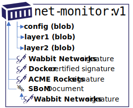

# Notary v2 February 2021 Status

Since December 2019, teams have been meeting regularly, as captured in the [Notary v2 notes][nv2-notes]. [Requirements][nv2-requirements] and a [focused prototype][nv2-prototype] have been completed, enabling conversations to upstream projects.

To deliver Notary v2, we recognized the need of experts from multiple backgrounds, experiences and skill sets. The various perspectives were needed to assure we learned from past efforts and learned from subject matter experts.

[Stages of Development](./README.md#stages-of-development) were identified with the following February 2021 progress:

1. [Define Requirements](#define-requirements)
1. [Build Prototypes](#build-prototypes)
1. [Validate Prototypes](#validate-prototypes)
1. [Author a Notary v2 Spec](#author-a-notary-v2-spec)

To complete Notary v2, key areas of focus were identified, with the following progress:

1. [Definition of a Notary v2 Signature](#definition-of-a-notary-v2-signature)
1. [Registry Persistance, Discovery and Retrieval](#registry-persistance-discovery-and-retrieval)
1. [Key Management](#key-management)
1. [Policy Management](#policy-management)

## Stages

### Define Requirements

[Baseline requirements][nv2-requirements] have been defined, enabling focused prototyping. Additional requirements are being discussed as PRs:

- [Add ephemeral clients as a core scenario #25](https://github.com/notaryproject/requirements/issues/25)
- [Should tags be signed in addition to digests? #43](https://github.com/notaryproject/requirements/issues/43)

### Build Prototypes

In September of 2020, a focused prototype for signing, integration with a registry and client validation were completed.

The prototype focused on:

- Signing a container image with a prototype of an [nv2 client](https://github.com/notaryproject/nv2).
- Pushing to an instance of the [CNCF Distribution][cncf-distribution] based registry, with exploratory [prototype enhancements](https://github.com/notaryproject/distribution/pull/2).
- Discovery of signatures, based on a [verification by reference](https://github.com/notaryproject/requirements/blob/main/verification-by-reference.md) design.
- Validation of a signature with the `nv2` client, using the public key pair used to sign the artifact.

Details of the September 2020 Prototype:

- [Video of prototype-1](https://youtu.be/ciNW19F_T_8?t=367)  
- [Steps to reproduce the prototype-1 nv2 client](https://github.com/notaryproject/nv2/tree/prototype-1/docs/nv2)

The prototypes have enabled participants and subject matter experts to identify additional areas of focus, such as how [policy management capabilities](https://github.com/notaryproject/requirements/issues/42) may be applied to Notary v2 signature validation.

### Validate Prototypes

With a focused nv2 client validation complete, the next phase will integrate policy management rules, using [OPA][opa] and [Gatekeeper][gatekeeper]. These additional validations will surface gaps in the workflow, including key management, and what policies may be supported through multiple Notary v2 keys. Air-gap environments will likely surface additional details to be addressed, including key-revocation capabilities.

## Areas of Focus

1. [Definition of a Notary v2 Signature](#definition-of-a-notary-v2-signature)
1. [Registry Persistance, Discovery and Retrieval](#registry-persistance-discovery-and-retrieval)
1. [Key Management](#key-management)
1. [Policy Management](#policy-management)

### Definition of a Notary v2 Signature

A [Prototype-1 Signature Spec][nv2-signature-spec] has been defined, serializing as a [JWT](https://tools.ietf.org/html/rfc7519) variant. While additional signature types may be added, a baseline signature spec has enabled validation of the other areas of focus, including registry persistance, discovery & retrieval.

### Registry Persistance, Discovery and Retrieval

To validate the end to end experiences, an experimental change to [CNCF Distribution](https://github.com/notaryproject/distribution/pull/2/) enabled linking of a container image and an independent Notary v2 signature.

An experimental docker plug-in called [docker-generate](https://github.com/shizhMSFT/docker-generate) generates a local manifest, used to generate the signature. The plug-in extends the `docker push` command to push the signature and make an additional link API request of the registry.

This prototype inspired a new [OCI Artifact Manifest][oci-artifact-manifest], which provides a way for artifacts to define the target artifact (`manifest`) they are linking to.

Additional signature types have also been discussed, including [IBM Simple Signing](https://cloud.ibm.com/docs/Registry?topic=Registry-registry_trustedcontent) and a [cosign prototype](https://github.com/projectcosign/cosign), developed by [Dan Lorenc](https://github.com/dlorenc) which would benefit from the [OCI Artifact Manifest][oci-artifact-manifest] linking proposal. Supporting additional signature types is not within the Notary v2 scope, rather a benefit from the OCI Artifact manifest approach for linking Notary v2 signatures.

To support discovery of linked artifacts, [OCI Distribution-spec list API requirements](https://github.com/opencontainers/distribution-spec/pull/229) have begun. Conversations whether the linking API should be part of the [OCI distribution-spec][oci-distribution-spec], or a registry extension defined in [OCI Artifacts][oci-artifacts] are being considered.

#### Key Management

Early on, a preliminary [Notary v2 thread model](https://github.com/notaryproject/requirements/blob/main/threatmodel.md) was defined, with [key management requirements forming](https://github.com/notaryproject/requirements/pull/38). Key management is an area of additional focus in 2021 as we focus on:

- Publishing and discovery of public keys for consumers to validate signatures
- Key revocation, including support for air-gapped environments

#### Policy Management

As OPA/Gatekeeper prototypes are started in 2021, a set of policy management requirements will surface. Notary v2 will not defined a policy management solution, rather it will provide options for policy management solutions to interact with.

#### Author a Notary v2 Spec

A [Notary v2 signature][nv2-signature-spec] spec has been prototyped. As the OCI Artifact Manifest and Manifest Link API proposals proceed, with subsequent prototype validations, the Notary v2 spec will begin.

### Plans for 2021

2020 focused on requirements gathering and initial prototypes to validate the requirements could be met. 2021 will focus on building end to end prototypes, including integration with Kubernetes, OPA and Gatekeeper. The changes required for registry persistence, discovery and retrieval will be hardened enabling registry operators and registry projects to implement the changes. The goal being user validations, and gap analysis of requirements and/or prototypes. These final validations will lead to a Notary v2 specification.

The following goals are set for 2021:

1. Extend [OCI Artifacts][oci-artifacts] to support reverse lookup capabilities for signatures and SBoMs.
    1. An [oci.artifact.manifest proposal][oci-artifact-manifest] has begun review.
    1. [Design a manifest](https://github.com/opencontainers/distribution-spec/pull/229) - linked-list lookup distribution API for discovering linked artifacts, such as Notary v2 signatures.
    1. Once a stable proposal is reached, implement it in [CNCF Distribution][cncf-distribution] with the ability for users to self-instance the solution.
    1. The design should be strong enough for cloud providers and registry projects to implement in sand-boxed environments for user validation.
1. Prototype policy management rules, using something like [OPA][opa] and [Gatekeeper][gatekeeper].
1. Build out key management requirements, including discovery of public keys, and key revocation scenarios across public and private/air-gapped environments.
1. Engage users and customers for feedback on the end to end capabilities.
1. Begin a Notary v2 spec that captures the learnings.

[cncf-distribution]:            https://github.com/distribution/distribution  
[containerd]:                   https://github.com/containerd
[docker-client]:                https://www.docker.com/products/docker-desktop
[gatekeeper]:                   https://github.com/open-policy-agent/gatekeeper
[kickoff-attendees]:            https://github.com/notaryproject/meeting-notes/blob/main/meeting-notes-2019.md#attendees
[moby]:                         https://github.com/moby
[notaryv2-kickoff]:             https://github.com/notaryproject/meeting-notes/blob/main/meeting-notes-2019.md#notary-v2-kickoff-meeting
[non-requirements]:             https://github.com/notaryproject/requirements#non-goals
[nv2-notes]:                    https://hackmd.io/_vrqBGAOSUC_VWvFzWruZw
[nv2-requirements]:             https://github.com/notaryproject/requirements
[nv2-scenarios]:                https://github.com/notaryproject/requirements/blob/main/scenarios.md
[nv2-prototype]:                https://github.com/notaryproject/nv2/tree/prototype-1/docs/nv2
[nv2-signature-spec]:           https://github.com/notaryproject/nv2/tree/prototype-1/docs/signature
[nv2-key-management]:           https://github.com/notaryproject/requirements/pull/38/
[nv2-distribution-spec]:        https://github.com/opencontainers/artifacts/pull/29
[oci-artifacts]:                https://github.com/opencontainers/artifacts
[oci-artifact-manifest]:        https://github.com/opencontainers/artifacts/pull/29
[oci-distribution-spec]:        https://github.com/opencontainers/distribution-spec
[oci-distribution-conformance]: https://github.com/opencontainers/oci-conformance
[opa]:                          https://github.com/open-policy-agent
[oras]:                         https://github.com/deislabs/oras
