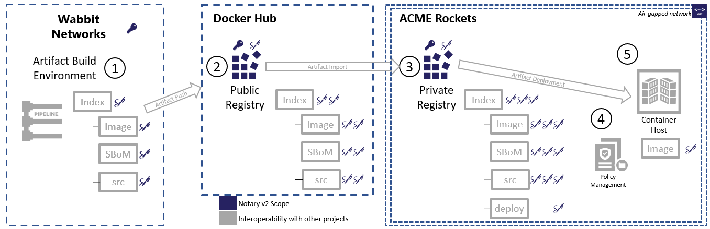

# Notary v2 Signing Scenarios

As containers and cloud native artifacts become the common unit of deployment, users want to know the artifacts in their environments are authentic and unmodified.

These Notary v2 scenarios define end-to-end scenarios for signing artifacts in a generalized way, storing and moving them between OCI compliant registries, validating them with various artifact hosts and tooling. Notary v2 focuses on the signing of content, enabling e2e workflows, without specifying what those workflows must be.

By developing a generalized solution, artifact authors may develop their unique artifact types, allowing them to leverage Notary for signing and OCI Compliant registries for distribution.

## Scenarios

Notary v2 aims to solve the core issue of trusting content within, and across registries. There are many elements of an end to end scenario that are not implemented by Notary v2, rather enabled because the content is verifiable.

### Scenario #0: Build, Publish, Consume, Enforce Policy, Deploy

To put Notary v2 in context, the following end-to-end scenario is outlined. The blue elements are the scope of Notary v2, with the other elements providing generic references to other projects or products that demonstrate how Notary v2 may be utilized.

In a world of consuming public software, we must account for content that's acquired from a public source, copied into a trusted environment, then deployed. In this scenario, the consumer is not re-building or adding additional content. However, they do wish to add attestations to the validity of the content.

1. The Wabbit Networks company builds their netmonitor software.
      * As a result of the build, they produce an [OCI Image][oci-image], a Software Bill of Materials (`SBoM`) and to comply with gpl licensing, produce another artifact which contains the source (`src`) to all the gpl licensed projects.  
      * In addition to the `image`, `SBoM` and `src` artifacts, the build system produces an [OCI Index][oci-index] that encompassed the three artifacts.
      * Each of the artifacts, and the encompassing `index` are signed with the Notary v2 wabbit-networks key.  
2. The Wabbit Networks net-monitor index and its signed contents are pushed to a public OCI compliant registry.
      * Docker can provide an additional Docker hub signature providing an extra level of certification confidence.
3. ACME Rockets consumes the netmonitor software, importing the index and its referenced artifacts into their private registry.
      * ACME Rockets verifies the content, including additional scanning and functional testing for their environment.
      * The SBoM is trusted as they trust artifacts signed by wabbit-networks, or possibly defer trust to the Docker Hub certification signature.
      * They denote verification of the SBoM and scanning with an ACME Rockets signature.
      * A `deploy` artifact, referencing a specific configuration definition, may also be signed and saved, providing a historical record of what was deployed.
4. The ACME Rockets environment may enforce various policies prior to deployment:
      * Evaluating the content in the `SBoM` for policies on specific packages.
      * ACME Rockets only allows content signed by ACME Rockets to be deployed, and only from the registry identified in the ACME Rockets signature.
      * Once validated, the `src` and `SBoM` are no longer needed for deployment allowing the `image` to be deployed separately with it's own signature.
5. Once the policy manager completes its validation (k8s ingress controller with OPA), the deployment to the hosting environment is initiated.
      * ACME Rockets runs in an air-gapped environment, requiring all key access to be resolved within their environment.

**Implications of this requirement:**

* Signatures can be placed on any type of [artifact](artifacts-repo) stored in an OCI compliant registry using an [OCI Manifest][oci-manifest]
* Signatures can be placed on an [OCI Index][oci-index], allowing a entity to define a collection of artifacts.
* Signatures and their public keys can be moved within, and across OCI compliant registries which support Notary v2.
* Because content is trusted, an ecosystem of other projects and products can leverage information in various formats.

### Scenario #1: Local Build, Sign, Validate

Prior to committing any code, a developer can test the: "build, sign, validate scenario"

1. Locally build a container image using a non-registry specific `name:tag`, such as:  
  `$ tool build net-monitor:dev`
1. Locally sign `net-monitor:dev`
1. Run the image on the developers local machine which is configured to only accept signed images.
  `$ host run net-monitor:dev`

**Implications of this requirement:**

* The developer has access to signing keys. How they get the keys will be part of a usability or design spec.
* The local environment has a policy by which it states the set of keys it accepts.
* The signing and validation of artifacts does not require a registry. The local host can validate the signature using the public keys it accepts.
* The key used for validation may be hosted in a registry, or other accessible location.
* The lack of a registry name does not infer docker.io as a default registry.
* Signing is performed on the artifacts that may be pushed to a registry.
* The verification of the signature can occur without additional transformation or computation. If the artifact is expected to be compressed, the signature will be performed on the compressed artifact rather than the uncompressed content.

### Scenario #2: Sign, Rename, Push, Validate in Dev

Once the developer has locally validated the build, sign, validate scenario, they will push the artifact to a registry used for deployment to a dev environment.

1. Locally build and sign an artifact, such as a `net-monitor:abc123` container image
1. Rename the artifact to reflect the registry it will be pushed to:  
  `$ tool tag net-monitor:abc123 wabbitnetworks.example.com/networking/net-monitor:1.0`  
  `$ tool push wabbitnetworks.example.com/networking/net-monitor:1.0`
1. Deploy the artifact to a cluster that requires signatures:  
  `$ orchestrator apply -f deploy.yaml`
1. The orchestrator in the dev environment accepts any signed content, enabling it to trace where deployed artifacts originated from.

**Implications of this requirement:**

* Signatures are verified based on manifest of the referenced `artifact:tag`.
* The artifact can be renamed from the unique build id `net-monitor:abc123` to a product versioned tag `wabbitnetworks.example.com/networking/net-monitor:1.0` without invalidating the signature.
* Users may reference the `sha256` digest directly, or the `artifact:tag`. While tag locking is not part of the [OCI Distribution Spec][oci-distribution], various registries support this capability, allowing users to reference human readable tags, as opposed to long digests. Either reference is supported with Notary v2, however it's the unique manifest that is signed.
* Notary v2 supports a pattern for signing any type of artifact, from OCI Images, Helm Charts, Singularity to yet unknown types.
* Orchestrators may require signatures, but not enforce specific specific signatures. This enables a host to understand what content is deployed, without having to manage specific keys.

### Scenario #3: Automate Build, Sign, Push, Deploy to Prod, Verify

A CI system is triggered by a git commit. The system builds the artifacts, signs them, and pushes to a registry. The production system pulls the artifacts, verifies the signatures and runs them.

1. A CI solution responds to a git commit notification
1. The CI system clones the git repo and builds the artifacts, with fully qualified names:  
  **image**: `wabbitnetworks.example.com/networking/net-monitor:1.0-alpine`
  **deployment chart**: `wabbitnetworks.example.com/networking/net-monitor:1.0-deploy`
1. The CI system signs the artifact with private keys.
1. The CI system creates a signed OCI Index, referencing the image and deployment charts:  
  `wabbitnetworks.example.com/networking/net-monitor:1.0`
1. The index, and its contents are pushed to a registry:  
  `$ oci-tool push wabbitnetworks.example.com/networking/net-monitor:1.0-alpine`  
  `$ deploy-tool push wabbitnetworks.example.com/networking/net-monitor:1.0-deploy`  
  `$ oci-tool push wabbitnetworks.example.com/networking/net-monitor:1.0`
1. The artifacts are deployed to a production orchestrator.
1. The orchestrator verifies the artifacts are signed by a set of specifically trusted keys. Unsigned artifacts, or artifacts signed by non-trusted keys are rejected.

**Implications of this requirement:**

* Keys for signing are securely retrieved by build systems that create & destroy the environment each time or alternatively the signing is offloaded to an external system, without exposing the private key to the CI system.
* A specific set of keys may be required to pass validation.

### Scenario #4: Promote Artifacts Within a Registry

A CI/CD system promotes validated artifacts from a dev repository to production repositories.

1. A CI/CD solution responds to a git commit notification, cloning, building, signing and pushing the artifacts to a development repo within their registry.
1. As the CI/CD solution runs functional tests, determining the artifacts are ready for production, the artifacts are moved from one repo to another.  
  `$ oci-tool tag myregistry.example.com/dev/alpha-team/web:1abc myregistry.example.com/prod/web:1abc`

### Scenario #4.1: Archive Artifacts Within a Registry

Once artifacts are no longer running in production, they are archived for a period of months. They are moved out of the production registry or repo as they must be maintained in the state they were run for compliance requirements.

1. A lifecycle management solution moves artifacts from production repositories to archived repositories and/or registries.

**Implications of this requirement:**

* Changing the path to an artifact maintains artifact signatures.
* Artifact copy, or movement to a different repository within the same registry maintains the signatures.

### Scenario #5: Validate Artifact Signatures Within Restricted Networks

ACME Rockets runs secure air-gapped production environments, limiting all external network traffic. To assure the wabbit-networks network monitor software has valid signatures, it must be possible to verify the software without access to wabbit-networks systems.

1. ACME Rockets acquires network monitoring software, copying it to their firewall protected production environment.
1. As part of the artifact copy, ACME Rockets copies all other resources that are required for successful signature validation.

**Implications of this requirement:**

* In this scenario, the wabbit-networks signature must be validated within the ACME Rockets network. How this is done is open for design. However, the requirement states the signature must be validated without external access.
* When the artifact is copied to the private/network restricted registry, the signature may need to be copied, and is assumed to be trusted if available in the trusted server within the private network.
* How ACME Rockets would copy the signatures is part of the key management scenarios.
* How ACME Rockets handles revoked keys is also part of the key management scenarios.

### Scenario #6: Multiple Signatures

Customers may require multiple signatures for the following scenarios:

* Validate the artifact is the same as what the vendor provided.
* Secondarily sign the artifact by the consuming company, attesting to its validity within their production environment.
* Signatures represent validations through different dev, staging, production environments.
* Crypto algorithms may be deprecated, requiring new signatures to be added, while maintaining a grace period of both signatures.
* Dev environments support any signature, while integration and production environments require acme-rockets-prod signatures.

#### Scenario #6.1: Dev and Prod Keys

1. A CI/CD solution builds, signs, pushes and deploys a collection of artifacts to a staging environment.
1. Once integrations tests are completed, the artifacts are signed with a production signature, copying them to a production registry or production set of repositories.
    * `myregistry.example.com/dev/alpha-team/web:1abc` - signed with the **alpha-team dev** key
    * `myregistry.example.com/prod/web:1abc` - signed with the **prod** key
1. The integration and production orchestrators validate the artifacts are signed with production keys.

#### Scenario #6.2: Approved Vendor/Project Artifacts

A deployment requires a mydb image. The mydb image is routinely updated for security vulnerabilities. ACME Rockets references stable version tags (`mydb:1.0`), assuring they get newly patched builds, but they must verify each new version to be compatible with their environment.

1. The `mydb:1.0` image is acquired from a public registry, imported into private integration registries.
1. Functional testing is run in the integration environment, verifying the patched `mydb:1.0` image is compatible.
1. The `mydb:1.0` is tagged with a unique id `mydb:1.0-202002131000` and signed with an ACME Rockets production key.
1. The re-tagged image, with both the mydb and ACME Rockets signatures are copied to a prod registry/repository.
1. The release management system deploys the new `mydb:1.0-202002131000` image.
1. The production orchestrator validates it's signed with the Acme Rockets production key.

**Implications of this requirement:**

* Multiple signatures, including signatures from multiple sources can be associated with a specific artifact.
* Original signatures are maintained, even if the artifact is re-tagged.

### Scenario #7: Repository Compromise - Non Signed Content

An attacker gains access to a registry and/or repository within a registry, pushing content that is suspect.

In this scenario, the attacker didn't have the private keys to sign the new content. They pushed unsigned content to existing tags.

1. An attacker gains access to the credentials, allowing them to push new content.
1. The attacker pushes an artifact with compatible behavior, with an additional exploit.
1. The new compromised artifact is pushed with an existing tag, but not signed.
1. Consumers of the artifact that don't check for signatures are unaware of the exploit as it produces the same original behavior.
1. Historical data is maintained, enabling forensics when it's realized compromised content was pushed.
1. All newly pushed content, from the time of compromise is removed, restoring content and tags to their previous state.
1. Consumers that pulled the new exploited tags will identify the digest are different, pulling the restored/original manifest and its associated content.

**Implications of this requirement:**

1. The potential damage/risk to consumers must be limited.
1. There must be a secure way for users to recover to a known, secure state and verify this has occurred even in the face of an attacker that can act as a man-in-the-middle on the network.
1. How a registry implements the rollback to the previously secured state is a differentiating capability. The scenario simply calls out a compromise that must be discoverable through forensic logging of who, when and what was pushed. The logged updates must include previous digests that represented updated tags allowing a registry, or external tools, to reset its original state.
1. A registry may choose to make repos, or the entire registry, restricted to pushing only signed content, and potentially only signed content with one or more keys. Notary v2 doesn't require this capability, rather highlights the scenario for registry operators to innovate means to secure from this scenario.

#### Scenario #7.1: Repository Compromise - Mutable Tags Modified

An attacker gains access to a registry and/or repository within a registry, changing the tag reference to a different digest. This different digest may be either a less-secure image (downgrading from a hardened image to one with more features that may be attacked), or a replay to an older vulnerable version of the same tag.

In this scenario, the attacker didn't have the private keys to sign the new content. Instead, they modified tags to point to previously signed content and either reused the signatures already on the registry for the digest, or pushed stale signatures from a previous state of the registry.

1. An attacker gains access to the credentials, allowing them to push new content.
1. The attacker pushes an old artifact with compatible behavior, either with an old exploit or additional capabilities that exposes vulnerabilities.
1. The current tag is updated to reference the vulnerable artifact.
1. The digest for the vulnerable artifact is either already signed, or a stale signature is available from when it was previously signed.
1. Consumers of the artifact that do not verify the tag points to the current digest from the original signer may run vulnerable containers.
1. Consumers that verify tag signatures are current should detect the invalid content, and reject the tag reference to the vulnerable digest.

**Implications of this requirement:**

1. There must be a secure way for users to verify the tag currently points to a specific digest, preventing rollback attacks.
1. If signed data does not expire, there's a potential for stale signed data to be replayed, particularly to ephemeral clients.
1. The solution should resist attackers acting as a man-in-the-middle on the network.
1. The solution should support artifacts being copied to different repositories, registries, and even a disconnected network.

### Scenario #8: A Developer Discloses Their Key and/or Credentials

A developer accidentally discloses the private key they use to certify their software is authentic.

1. A developer accidentally checks their private key into a github repository.
1. A developer references a compromised package that searches for private keys within the build system and `curl`s it a location of an attacker.
1. A developer may have scripted the means by which secured content is added to a registry and the script (and related credentials & secrets) have all been disclosed.
1. Whether 5 minutes or 5 days, the developer must assume the pubic key was copied and new content may be pushed to this, or any other registry claiming it represents the identify of the private key.
1. The attacker may not have credentials to push content to a the registry in focus, but they may push similarly named content to other public registries, misrepresenting the identity.
1. The developer revokes their public key, indicating it's no longer valid.
1. The developer issues a new public key and re-signs their content.
1. The developer can examine their registry, or any other registry they have diagnostic access to for what new content may have been pushed with the compromised key.

**Implications of this requirement:**

1. All Notary v2 implementations support key revocation as part of their implementation to assure signed content is still valid content.
1. Registry operators routinely check for revoked keys and remediate the exploited content.
1. Notary v2 clients routinely check for revoked keys and block the content.

### Scenario #9: A Crypto Algorithm Is Deprecated

A weakness is discovered in a widely used cryptographic algorithm and a decision is made to deprecate its use in favor of one or more newer algorithms. It should be possible to migrate smoothly to the new algorithm(s), despite the fact that developers will adopt the new signing algorithm(s) piecemeal.

1. A build system has been using version **n** of a crypto library for the last 3 years, signing thousands of artifacts.
1. A new version is available and developers migrate to the new library.
1. The build system starts signing all new artifacts with the new library.
1. Developers may add a new signature to existing artifacts without having to rebuild each artifact.
1. A grace period of **n** days or months is identified, allowing consumers to accept both the previous and newly signed content.

**Implications of this requirement:**

1. There must be a means to support using multiple different cryptographic algorithms of varying types. The client and server must be able to use them in coordination, without requiring a "flag day" where everyone swaps over.
1. The signed content has metadata indicating the algorithm used, so clients may enforce a policy of which they support.
1. Key revocation, chain of trust, etc. must all work for the expected lifetime of a version of the client software while these changes are made.
1. The actions that different parties need to perform must be clearly articulated, along with the result of not performing those actions.

### Scenario #11: Chaining from a trusted key

If a user does not have a specific key for a given artifact, verified using a third party system, they will need to determine the trusted signing key(s) for an artifact by chaining from a trusted key.

1. The user determines the trusted key(s) for a specific artifact using delegations from a trusted root.
1. The user downloads and verifies an artifact using Notary v2 and the trusted key(s) discovered in the previous step.

**Implications of this requirement**

1. Users must be able to use the chain of trust to obtain per-package trusted keys, verified by a trusted root.
1. Users must be able to access the chain of delegations.
1. Users must be able to configure roots of trust.

### Scenario #12: Using multiple roots of trust

A user using multiple registries will want to ensure artifacts are verified using the correct root of trust. For example, if an artifact is supposed to be signed by a key delegated to their private registry, they never want to download a version signed by a key from a public registry. Additionally, they may always want to look for artifacts signed by their private registry key first, and so want an enforced ordering of roots of trust.

1. The user attempts to download and verify a package using roots of trust in priority order.
1. Notary v2 verifies that each specific artifact may be verified using a given root of trust during validation using the user's configuration information.

**Implications of this requirement**

1. Users must be able to prioritize each root of trust that they use.
1. Users must be able to specify that a particular artifact may only be verified using a key delegated from a given root of trust.

## Open Discussions

* What is the relationship between a signature, an artifact and a registry?
* Can signature validation be dependent on an external entity?

[acr]:              https://aka.ms/acr/artifacts
[artifacts-repo]:   https://github.com/opencontainers/artifacts
[docker-hub]:       https://hub.docker.com/
[docker-dtr]:       https://www.docker.com/products/image-registry
[ecr]:              https://aws.amazon.com/ecr/
[gcr]:              https://cloud.google.com/container-registry/
[gpr]:              https://github.com/features/package-registry
[harbor]:           https://goharbor.io/
[icr]:              https://icr.io/
[helm-registry]:    https://v3.helm.sh/docs/topics/registries/
[image-spec]:       https://github.com/opencontainers/image-spec
[jfrog]:            https://jfrog.com/integration/docker-registry/
[oci-distribution]: https://github.com/opencontainers/distribution-spec
[oci-image]:        https://github.com/opencontainers/image-spec
[oci-index]:        https://github.com/opencontainers/image-spec/blob/master/image-index.md
[oci-manifest]:     https://github.com/opencontainers/image-spec/blob/master/manifest.md
[oci-tob]:          https://github.com/opencontainers/tob
[singularity]:      https://github.com/sylabs/singularity
[quay]:             https://quay.io/
