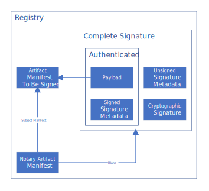

# Signature Specification

This document specifies the signature format and its protocol.


## Terminology

SignatureEnvelope `e` : The standard data structure for storing a signed message. Signature envelope consist of following components:

- Payload `m`: The data that is integrity protected - e.g. container image descriptor.
- Signed attributes `v`: The signature metadata that is integrity protected - e.g. signature expiration time, signing time, etc.
- Unsigned attributes `u`: The signature metadata that is not integrity protected - e.g. keyid, publickey, etc.
- Cryptographic signatures `s`: The digital signatures computed on payload and signed attributes.

A signature `s = Sign(sk, m, v)` where `sk` stands for signing key.
A signature envelope `e_n = { m, (v_0, u_0, s_0), ..., (v_{n-1}, u_{n-1}, s_{n-1})}` is a compact form of `n` signatures signing the same payload `m`.




## Requirements

### Signature Envelope and Signature

1. The signature envelope payload MUST contain a [descriptor](https://github.com/opencontainers/image-spec/blob/master/descriptor.md#properties) of the target manifest.
    1. A descriptor MUST contain `mediaType`, `digest`, `size` fields.
    2. A descriptor MAY contain the `artifactType` field for artifact manifests, or the `config.mediaType` for `oci.image` based manifests.
    3. descriptor MAY contain a `annotations` field.
2. The signature envelope MUST be self contained to validate the integrity of the payload and signed attributes.
3. The signature envelope MAY contain arbitrary user supplied information, as key value pairs. If included, it MUST be integrity protected.
4. The signature envelope MAY contain information to determine the signature expiration time. If included, it MUST be integrity protected.
5. The signature envelope MAY contain information to determine the signature revocation status. If included, it MUST be integrity protected.
6. The signature MUST be detached a signature, with respect to the target manifest being signed.
7.  The signature MUST be stored and transferred in a signature envelope.
8.  If the signature was produced by a X.509 certificate, the signature MUST contain a certificate chain of the signing certificate as an unsigned attribute. This MAY be a partial certificate chain.
9.  The signature MAY be timestamped by TSA, and this counter signature MUST be stored as an unsigned attribute.

### Signature Format

1. The signature format MUST be able to store payload.
2. The signature format MUST be able to store cryptographic signature.
3. The signature format MUST support referencing and in-lining of different signing identity types represented as keyIds or X.509 certificate chains.
4. The signature format MUST be able store unsigned signature attributes such as timestamp signature (TSA).
5. Signature format SHOULD be easy to implement using existing Go libraries (Docker CLI is implemented in Go).
6. The signature format MAY be able store signed attributes. In case signature format doesn't support signed attributes, they can be combined with the payload before signing. Since the payload contains the signature specific metadata, the signature format loses the ability to store multiple signatures.
7. The signature format MAY store multiple signatures generated using same or different cryptographic materials (signing identity types and signing algorithms).
8. The signature format SHOULD NOT indicate signing algorithm, if present it MUST be a signed attribute. (There are concerns on the signing algorithm not matching the verification key, see [CS-DRNT15-1 Section 3.3](https://github.com/theupdateframework/notary/blob/master/docs/resources/ncc_docker_notary_audit_2015_07_31.pdf), [A cross-protocol attack on the TLS protocol](https://doi.org/10.1145/2382196.2382206), [secure-systems-lab/dsse#35](https://github.com/secure-systems-lab/dsse/issues/35)).


## Signature Formats Explored

### JWS Compact Serialization (JWT) - [RFC7515 Section 3.1](https://datatracker.ietf.org/doc/html/rfc7515#section-3.1)

Notary v2 `prototype-2` shows [JWS compact serialization](https://github.com/notaryproject/nv2/tree/prototype-2/docs/signature).

Pros:

- Widely used in systems such as [OpenId](https://en.wikipedia.org/wiki/OpenID).
- Signing libraries available in Go: [golang-jwt/jwt](https://github.com/golang-jwt/jwt), [square/go-jose](https://github.com/square/go-jose), [lestrrat-go/jwx](https://github.com/lestrrat-go/jwx).
- Native support for certificate(s) and key id.
- Native support for signed attributes.

Cons:

- Has a history of vulnerable implementations due to the complexity and lack of specificity in the RFC. Vulnerabilities example: [algorithm substitution attack](https://auth0.com/blog/critical-vulnerabilities-in-json-web-token-libraries), bypassing signature verification by setting `alg = none`.
- Does not support unsigned attributes which means we cannot timestamp signature.
- As `alg` is a required header, implementing a format which instead gets the signing algorithm from the certificate, key store or application mapping, requires workarounds.
- Supports a single signature in an envelope.

<details><summary>Example (Click to show details)</summary>

`Payload` a.k.a. claims:

```json
{
    "notary.v2": { 
        "subjectManifest": {...},
        "signedAttrs": {
            "reserved": {...},
            "custom" : {...}
        }
    },
    "iat": 1624377760337,
    "exp": 1632153760337
}
```

`ProtectedHeader`:

```json
{
    "alg": "RS256",
    "cty": "application/<TBD>",
    "crit": [
        "cty"
    ]
}
```

`SignatureEnvelope`:

```
Base64Url(ProtectedHeader).Base64Url(Payload).Base64Url(
    Sign(
        ASCII(Base64Url(ProtectedHeader).Base64Url(Payload))
    )
)
```

</details>


### JWS JSON Serialization - [RFC7515 Section 3.2](https://datatracker.ietf.org/doc/html/rfc7515#section-3.2)

Pros:

- JWS is an IETF proposed (RFC 7515) standard with guidance around representation, serialization and verification.
- Signing libraries available in Go: [square/go-jose](https://github.com/square/go-jose), [lestrrat-go/jwx](https://github.com/lestrrat-go/jwx).
- Native support for certificate(s) and key id.
- Native support for signed and unsigned attributes.
- Supports multiple signatures in the same envelope.

Cons:

- Has a history of vulnerable implementations such as [algorithm substitution attack](https://auth0.com/blog/critical-vulnerabilities-in-json-web-token-libraries), bypassing signature verification by setting `alg = none`. Some of the main concerns raised for JWS, can they be addressed with additional layer of validation on top of core libraries.
- As specification is complex and lacks specificity, there is probability of user shooting themselves in the foot with incorrect implementation, or insufficient validations.

<details><summary>Example (Click to show details)</summary>

`Payload` a.k.a. claims:

```json
{
    "notary.v2": {
        "subjectManifest": {
            "mediaType": "application/vnd.oci.image.manifest.v1+json",
            "digest": "sha256:73c803930ea3ba1e54bc25c2bdc53edd0284c62ed651fe7b00369da519a3c333",
            "size": 16724,
            "annotations": {
                "org.acme-rockets.importDate": "2021-04-23T18:25:43.511Z"
            }
        },
        "signedAttrs": {
            "reserved": {
                "arl": "http://registry.wabbit.net/arl",
                "identity": "acme-rockets.io/net-monitor:v1"
            },
            "custom": {
                "buildId": "0001",
                "imageScanned": "true"
            }
        }
    },
    "iat": 1624377760337,
    "exp": 1632153760337
}
```

`Payload` contains the subject manifest and other attributes that have to be integrity protected.

- `notary.v2`: Top level node and private claim, encapsulating the notary v2 data. This claim MUST be present.
- `subjectManifest`: The image manifest that needs to be integrity protected.
- `signedAttrs`: Contains additional attributes that needs to be integrity protected.
    - `reserved`: Collection of attributes reserved for notary v2 use such as artifact revocation list (ARL), identity, etc.
    - `custom`: Collection of user defined attributes such as buildId, imageScanned, etc. Use of this field is OPTIONAL.
- `iat`: Issued at identifies the time at which the JWT was issued. This claim MUST be present.
- `exp`: Expiration time identifies the expiration time on or after which the JWT must not be accepted for processing. This claim MUST be present.
- In order to leverage JWS claims validation functionality already provided by libraries we have defined `iat`, `exp` as top-level nodes.

`ProtectedHeader`:

```json
{
    "alg": "RS256",
    "cty": "application/<TBD>",
    "crit": [
        "cty"
    ]
}
```

- `alg`: JWS needs algorithm `alg` to be present in header so we have added it as protected header. This header MUST be present.
- `cty`: Content type `cty` used to declare the media type of the secured content (the payload). This header MUST be present.
- `crit`: Indicates the list of headers that implementation MUST understood and process. This header MUST be present.

`SignatureEnvelope`:

```json
{
    "payload": "<Base64Url(Payload)>",
    "signatures": [
        {
            "protected": "<Base64Url(ProtectedHeader)>",
            "header": {
                "timestamp": "<Base64(TimeStampToken)>",
                "kid": "906ade40b96cff95e5b60f7e96f2cda7979c8ad5",
                "x5c": [
                    "<Base64(DER(leafCert))>",
                    "<Base64(DER(intermediateCACert))>",
                    "<Base64(DER(rootCert))>"
                ]
            },
            "signature": "Base64Url( Sign( ASCII( <Base64Url(Payload)>.<Base64Url(ProtectedHeader)> ) ) )"
        }
    ]
}
```

If a JWS contains only one signature as above, the JWS can be flattened as

```json
{
    "payload": "<Base64Url(Payload)>",
    "protected": "<Base64Url(ProtectedHeader)>",
    "header": {
        "timestamp": "<Base64(TimeStampToken)>",
        "kid": "906ade40b96cff95e5b60f7e96f2cda7979c8ad5",
        "x5c": [
            "<Base64(DER(leafCert))>",
            "<Base64(DER(intermediateCACert))>",
            "<Base64(DER(rootCert))>"
        ]
    },
    "signature": "Base64Url( Sign( ASCII( <Base64Url(ProtectedHeader)>.<Base64Url(Payload)> )))"
}
```

- `protected`: Base64Url encoded JSON object that contains the header parameters that are integrity protected by the JWS Signature digital signature.
- `header`: JOSE Header containing the parameters describing the cryptographic operations and parameters employed. header is not integrity protected by signature. To start with we will only support reserved set of headers.
    - `timestamp`: Base64 encoded [timestamp token](https://datatracker.ietf.org/doc/html/rfc3161#section-2.4.2) generated by TSA. Use of this is OPTIONAL.
    - `kid`: Hint indicating which key was used to generate the signature. Use of this is OPTIONAL.
    - `x5c`: Contains the X.509 public key certificate or certificate chain corresponding to the key used to generate the signature. Use of this is OPTIONAL. If signature was generated by X.509 certificate signature envelop MUST contain `x5c`.
- The `header` node MUST contain either `kid` or `x5c` but not both.
- In case of `x5c`, the leaf certificate's public key algorithm (with some additional conventions) will be used for signature generation and this algorithm must match with `alg` header value. The verifier will make sure that the value of `alg` header is same as that of leaf certificate's signing algorithm.
    - Additional convention for algorithm: If the X.509 certificate does not indicate the hash algorithm (as is the case of ECDSA), then the implementation will use hard-code a mapping similar to that of [JWS](https://datatracker.ietf.org/doc/html/rfc7518#section-3.1).
- Implementation should only support predefined set of asymmetric signing algorithms, which means value of `alg` will always be from a predefined set of values.

</details>


### Dead Simple Signature Envelope ([DSSE](https://github.com/secure-systems-lab/dsse))

Pros:

- Simple, lesser probability of user shooting themselves in the foot.
- Signing libraries available in Go: [in-toto-golang](https://github.com/in-toto/in-toto-golang/commit/5b9e472f1a6e04f14d62266dd8e24749c2e9900c?branch=5b9e472f1a6e04f14d62266dd8e24749c2e9900c&diff=split).

Cons:

- No published RFC (or draft) and not commonly used. Only known usage is [in-toto](https://in-toto.io) and that [implementation also diverges from specification](https://github.com/secure-systems-lab/dsse/issues/40#issuecomment-882771124).
- No native support for signed attributes but we can add them to the payload, by creating a wrapped payload that includes original payload and other attributes to be signed.
- No native support for inlining of certificate(s). See [secure-systems-lab/dsse#42](https://github.com/secure-systems-lab/dsse/issues/42)
- Support for timestamp is under consideration. See [secure-systems-lab/dsse#33](https://github.com/secure-systems-lab/dsse/issues/33)

<details><summary>Example (Click to show details)</summary>

`Payload`:

```json
{
    "subjectManifest": {
        "mediaType": "application/vnd.oci.image.manifest.v1+json",
        "digest": "sha256:73c803930ea3ba1e54bc25c2bdc53edd0284c62ed651fe7b00369da519a3c333",
        "size": 16724,
        "annotations": {
            "org.acme-rockets.importDate": "2021-04-23T18:25:43.511Z"
        }
    },
    "signedAttrs": {
        "reserved": {
            "iat": "2021-06-22T16:02:40.3375379Z",
            "exp": "2021-09-20T16:02:40.3375379Z",
            "arl": "http://registry.wabbit.net/arl",
            "identity": "acme-rockets.io/net-monitor:v1"
        },
        "custom": {
            "BuildId": "0001",
            "imageScanned": "true"
        }
    }
}
```

`SignatureEnvelope`:

```json
{
    "payload": "<Base64(Payload)>",
    "payloadType": "application/<TBD>",
    "signatures": [
        {
            "keyid": "906ade40b96cff95e5b60f7e96f2cda7979c8ad5",
            "x5c": [ // field not supported
                "<Base64(DER(leafCert))>",
                "<Base64(DER(intermediateCACert))>",
                "<Base64(DER(rootCert))>"
            ],
            "timestamp": "<Base64(TimeStampToken)>", // field  under consideration 
            "sig": "Base64( Sign( <Base64(Payload)> ))"
        }
    ]
}
```

In `SignatureEnvelope`'s `signatures` node, MUST contain either `keyid` or `x5c` but not both.

</details>


### PKCS 7: Cryptographic Message Syntax (CMS) - [RFC2315](https://datatracker.ietf.org/doc/html/rfc2315), [RFC5652](https://datatracker.ietf.org/doc/html/rfc5652)

Pros:

- Widely used and battle tested, one of the mature standards.
- Native support for signed and unsigned attributes.
- TSA timestamp [signatures](https://datatracker.ietf.org/doc/html/rfc3161#section-2.4.2) are in PKCS7 format so system will need to understand only one signing format.

Cons:

- Lack of stable Go library and it's not straight forward to implement the specification. [mozilla.org/pkcs7](https://pkg.go.dev/go.mozilla.org/pkcs7) is not well maintained.
- Closely tied to X.509 certificates, no provision for supporting raw signing key.

<details><summary>Example (Click to show details)</summary>

The signature is stored in ASN.1 DER binary format and optionally wrapped in PEM blocks.

`Payload` a.k.a. eContent:

```json
{
    "notary.v2": {
        "subjectManifest": {...},
        "signedAttrs": {
            "reserved": {...},
            "custom": {...}
        }
    }
}
```

`signedAttrs`:

```
"signingTime": "2021-06-22T16:02:40.3375379Z",
"expirationTime": "2021-09-20T16:02:40.3375379Z",
"cmsAlgorithmProtection": "..."
```

`unsignedAttrs`:

```
"timestamp": "...."
```

`Signature Envelope`:

```
ContentInfo ::= SEQUENCE {
    contentType ContentType,
    content [0] SignedData }

ContentType ::= OBJECT IDENTIFIER

SignedData ::= SEQUENCE {
    version CMSVersion,
    digestAlgorithms DigestAlgorithmIdentifiers,
    encapContentInfo EncapsulatedContentInfo,
    certificates [0] IMPLICIT CertificateSet OPTIONAL,
    crls [1] IMPLICIT RevocationInfoChoices OPTIONAL,
    signerInfos SignerInfos }

CMSVersion ::= INTEGER{ v0(0), v1(1), v2(2), v3(3), v4(4), v5(5) }
    
DigestAlgorithmIdentifiers ::= SET OF DigestAlgorithmIdentifier

EncapsulatedContentInfo ::= SEQUENCE {
    eContentType ContentType,
    eContent [0] EXPLICIT OCTET STRING OPTIONAL }

SignerInfos ::= SET OF SignerInfo

SignerInfo ::= SEQUENCE {
    version CMSVersion,
    sid SignerIdentifier,
    digestAlgorithm DigestAlgorithmIdentifier,
    signedAttrs [0] IMPLICIT SignedAttributes OPTIONAL,
    signatureAlgorithm SignatureAlgorithmIdentifier,
    signature SignatureValue,
    unsignedAttrs [1] IMPLICIT UnsignedAttributes OPTIONAL }

SignerIdentifier ::= CHOICE {
    issuerAndSerialNumber IssuerAndSerialNumber,
    subjectKeyIdentifier [0] SubjectKeyIdentifier }

SignedAttributes ::= SET SIZE (1..MAX) OF Attribute

UnsignedAttributes ::= SET SIZE (1..MAX) OF Attribute

Attribute ::= SEQUENCE {
    attrType OBJECT IDENTIFIER,
    attrValues SET OF AttributeValue }

AttributeValue ::= ANY
SignatureValue ::= OCTET STRING
```

</details>


### Platform Agnostic Security Tokens ([PASETO](https://paseto.io))

Pros:

- Simple, lesser probability of user shooting themselves in the foot.
- Signing libraries available in Go: [lib/paseto](https://pkg.go.dev/github.com/shuLhan/share/lib/paseto?utm_source=godoc), [o1egl/paseto](https://github.com/o1egl/paseto).

Cons:

- No published RFC, although there is one in [draft](https://datatracker.ietf.org/doc/html/draft-paragon-paseto-rfc-00).
- Doesn't provides algorithm agility instead uses predefined algorithm (for recommended version v2, signing algorithm is `Ed25519`) which might not be supported by smart cards, HSMs and cloud based Key Management Systems. Also given that v2 only support `Ed25519` signing algorithm, which is not FIPS 140-2 approved thus system using it cannot be FIPS 140-2 compliant.
- No native support for referencing or inlining of certificate(s), keyId and timestamp (TSA). These are supported through a signed footer which can contain any structure.
- No native support for unsigned attributes and TSA signature.
- Doesn't support multiple signature in one signature envelope.

<details><summary>Example (Click to show details)</summary>

`payload`:

```json
{ 
    "subjectManifest": {...},
    "signedAttrs": {
        "reserved": {
            "iat": "2021-06-22T16:02:40.3375379Z",
            "exp": "2021-09-20T16:02:40.3375379Z",
            ...
        },
        "custom" : {...}
    }
}
```

`footer`:

```json
{
    "x5c": [
        "<Base64(DER(leafCert))>",
        "<Base64(DER(intermediateCACert))>",
        "<Base64(DER(rootCert))>"
    ],
    "timestamp": "<Base64(TimeStampToken)>"
}
```

`Signature Envelope`:

```
<version>.<purpose>.Base64Url(<payload><Sign(PAE(<version><purpose><payload>))>).Base64Url(<footer>)
```

- `version`: `v2`, v2 is recommended version.
- `Purpose`: `public`, public is used for signing.
- `PAE`: [Pre-Authentication Encoding](https://tools.ietf.org/id/draft-paragon-paseto-rfc-00.html#rfc.section.2.2.1)

</details>


### Red Hat's Simple Signing - [Simple Signing](https://www.redhat.com/en/blog/container-image-signing)

It is used by Red Hat for signing container image. Simple signing is *not a signature format* instead defines the payload format which is then signed using PGP to create detached signature. The payload format is adapted by atomic and later by [cosign](https://github.com/sigstore/cosign#payload-formats).

<details><summary>Example (Click to show details)</summary>

`payload`:

```json
{
    "critical": {
        "identity": {
            "docker-reference": "testing/manifest"
        },
        "image": {
            "Docker-manifest-digest": "sha256:20be...fe55"
        },
        "type": "atomic container signature"
    },
    "optional": {
        "creator": "atomic",
        "timestamp": 1458239713
    }
}
```

</details>


## Recommendation

### Signature format

Recommendation is to **use JWS JSON Serialization** because of following reasons:

- Specifications are parts of [RFC](https://datatracker.ietf.org/doc/html/rfc7515#section-3.2) standards.
- Native support for certificate(s), key id, signed and unsigned attributes.
- Signing libraries available in Go: [square/go-jose](https://github.com/square/go-jose), [lestrrat-go/jwx](https://github.com/lestrrat-go/jwx), [golang-jwt/jwt](github.com/golang-jwt/jwt) or general JWT libraries to produce / consume a JWS in compact serialization and convert it to / from JSON serialization by custom code.
- Security related concerns can be addressed with proper implementations.

Concerns with DSSE:

- No published RFC (or draft).
- New format that is used in few projects.
- Does not currently support TSA signature and certificate(s) chain as part of the envelope. See [secure-systems-lab/dsse#42](https://github.com/secure-systems-lab/dsse/issues/42),  [secure-systems-lab/dsse#33](https://github.com/secure-systems-lab/dsse/issues/33).
- Additional effort required to certify implementations with security groups of cloud service providers before adoption.
- Being a new format, additional effort is involved to get the implementations reviewed and certified by the compliance & security boards of cloud service providers before its usage. This is a part of component governance which is considered as a strict requirement to adopt technologies and implementations in cloud environments.

### Payload

Recommendation for payload is TBD.
