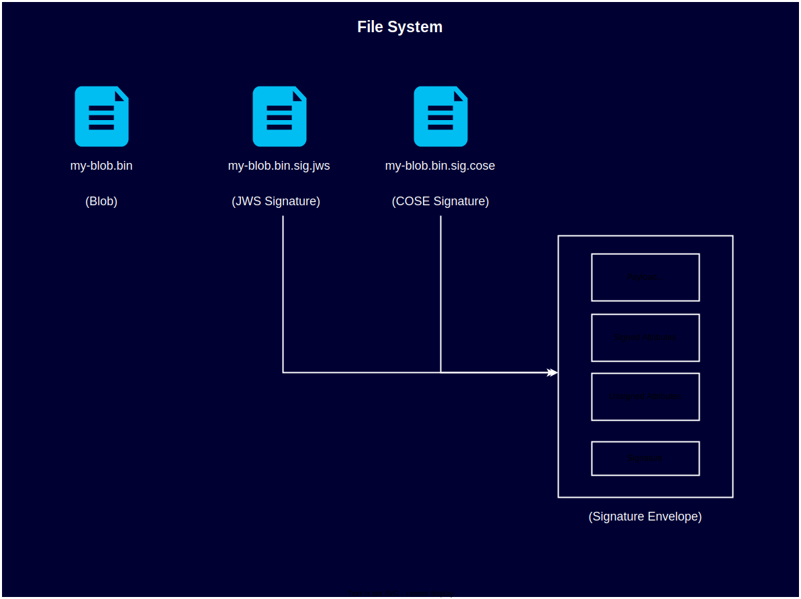

# Signature Specification

This document provides the following details for Notary Project signature:

- **[Signature Envelope](#signature-envelope)**: Describes the structure of the Notary Project signature.
- **[OCI Signatures](#storage)**: Describes how signatures are stored and retrieved from an OCI registry.
- **[Detached Signatures](#storage)**: Describes how detached signatures of Blobs are stored on file system

## Signature Envelope

The Signature Envelope is a standard data structure for creating a signed message.
A signature envelope consists of the following components:

- Payload/Message `m`: The data that is integrity protected - e.g. descriptor of the artifact being signed.
- Signed attributes `v`: The signature metadata that is integrity protected - e.g. signature expiration time, creation time, etc.
- Unsigned attributes `u`: These attributes are not signed by the signing key that generates the signature. We anticipate unsigned attributes contain content that may be signed by an different party e.g. Certificate chain signed by a CA, or TSA countersignature signed by the TSA.
- Cryptographic signatures `s`: The digital signatures computed on payload and signed attributes.

A signature envelope is `e = {m, v, u, s}` where `s` is signature.

This specification defines the set of signed and unsigned attributes that make up a valid Notary Project signature. This specification aims to be be agnostic of signature envelope format (e.g. COSE, JWS), details of encoding the envelope in a specific signature envelope format are covered in separate specs.

The Notary Project signature supports following envelope formats:

- [JWS](./signature-envelope-jws.md)
- [COSE](./signature-envelope-cose.md)

### Payload

The Notary Project signature payload is a JSON document with media type `application/vnd.cncf.notary.payload.v1+json` and has following properties.

- `targetArtifact` : Required property whose value is the descriptor of the target artifact manifest that is being signed.
- For OCI artifacts, this MUST be a valid [OCI descriptor][oci-descriptor].
  - Descriptor MUST contain `mediaType`, `digest`, and `size` fields.
  - Descriptor MAY contain `annotations` and if present it MUST follow the [annotation rules][annotation-rules].
  - Descriptor MAY contain `artifactType` field for the `config.mediaType` of OCI image manifests.
- For Blob artifacts, the descriptor MUST describe the blob that is being signed
  - Descriptor MUST contain `mediaType`, `digest`, and `size` fields.
  - `digest` MUST be the hash of the blob using the hashing algorithm deduced from signing certificate's public key. See [Algorithm Selection](#algorithm-selection)
  - `mediaType` can be any arbitrary media type that the user chooses to describe the blob. An example can be `application/octet-stream` 
  - `size` MUST be the raw size of the blob in bytes.
  - Blob descriptors MAY optionally contain `annotations` and if present it MUST follow the [annotation rules][annotation-rules]. 

NOTE: The Notary Project signature uses annotations for storing both Notary Project specific and user defined metadata. The prefix `io.cncf.notary` in `annotations` key is reserved for use in Notary Project signature and MUST NOT be used outside this specification.


#### Examples

##### OCI Payload

```jsonc
{
  "targetArtifact": {
    "mediaType": "sbom/example",
    "digest": "sha256:9834876dcfb05cb167a5c24953eba58c4ac89b1adf57f28f2f9d09af107ee8f0",
    "size": 32654
  }
}
```
##### OCI Payload with artifactType and annotations

```jsonc
{
  "targetArtifact": {
    "mediaType": "application/vnd.oci.image.manifest.v1+json",
    "digest": "sha256:73c803930ea3ba1e54bc25c2bdc53edd0284c62ed651fe7b00369da519a3c333",
    "size": 16724,
    "artifactType": "application/vnd.oci.image.config.v1+json",
    "annotations": {
        "io.wabbit-networks.buildId": "123"  // user defined metadata
    }
  }
}
```
##### Blob Payload

```jsonc
{
  "targetArtifact": {
    "mediaType": "application/octet-stream",
    "digest": "sha256:2f3a23b6373afb134ddcd864be8e037e34a662d090d33ee849471ff73c873345",
    "size": 1024
  }
}
```

### Signed Attributes

Signed attributes/claims are additional metadata apart from the payload, which are required to support the signature verification process.

- Any metadata that is used to verify the payload itself, and establish trust MUST be stored separately from the payload itself, as signed attributes or claims. Such metadata MUST NOT be stored/appended in the payload, as the payload is only parsed and processed once the signature has been verified and trust is established.
- Specific claims can be either required or optional.
- Claims that MUST be processed by a verifier MUST be marked as critical. Some claims may be optional and critical, i.e. they MUST be processed by a verifier only if they are present.
- Claims which are informational and do not influence signature verification MUST NOT be marked critical.

The Notary Project signature specification requires the signature envelope to support the following signed attributes/claims.

#### Standard attributes

- **Signing Scheme** (critical): A REQUIRED claim that defines the [Notary Project Signing Scheme](./signing-scheme.md) used by the signature. This attribute dictates the rest of signature schema - the set of signed and unsigned attributes to be included in the signature. Supported values are `notary.x509` and `notary.x509.signingAuthority`.
- **Signing Time**: A claim that indicates the time at which the signature was generated. Though this claim is signed by the signing key, it's considered unauthenticated as a signer can modify local time and manipulate this claim. More details [here](#signing-time). This claim is REQUIRED and only valid when signing scheme is `notary.x509`.
- **Authentic Signing Time** (critical): The authenticated time at which the signature was generated. This claim allows a verifier to determine if the signature was generated when the certificate was valid. This claim is REQUIRED and only valid when signing scheme is `notary.x509.signingAuthority`. More details [here](#signing-time).
- **Expiry** (critical): An OPTIONAL claim that provides a "best by use" time for the artifact, as defined by the signer. More details [here](#expiry).
- **Content Type** (critical): A REQUIRED claim that indicates the content type of the [payload](#payload). The supported value is `application/vnd.cncf.notary.payload.v1+json`. Other payload types MAY be supported in future.

#### Extended attributes

Implementations of the Notary Project signature specification MAY include additional signed attributes in the signature envelope.
These attributes MAY be marked critical, i.e. the attribute MUST be understood and processed by a verifier, unknown critical attributes MUST cause signature verification to fail.
Usage of extended signed attributes which are marked critical in signature will have implications on portability of the signature, these are discussed in [Signature Portability](#signature-portability) section.

#### Extended attributes for *Notation* Plugins

[Notation](https://github.com/notaryproject/notation) is a CLI and has set of libraries that offer an implementation of the Notary Project signature specification. Notation allows you to sign as well as verify artifacts against Notary Project signatures.

This section documents extended attributes used by Notation to support plugins.
Plugins is a *Notation* concept that allows parts of signing and verification logic to be performed by an external provider.
*Signing plugins* allow *Notation* to be extended for integration with remote keys, remote key management services, and signing services, where as *verification plugins* allow for customization of verification logic.
Detailed specification for plugins can be found [here](https://github.com/notaryproject/notaryproject/blob/main/specs/plugin-extensibility.md#notation-extensibility-for-signing-and-verification).
This specification documents these extended attributes, as implementations of the Notary Project signature specification may encounter these attributes, if they verify a signature that requires a verification plugin for complete signature verification.

- **Verification Plugin** (critical): An OPTIONAL attribute that specifies the name of the verification plugin that MAY be used to verify the signature e.g. "com.example.nv2plugin".
[Notation plugin](https://github.com/notaryproject/notaryproject/blob/main/specs/plugin-extensibility.md#plugin-contract) aware implementations use this attribute to load and execute a *Notation* compliant plugin.
The plugin participates in the overall signature verification workflow and performs specific steps in it.
- **Verification Plugin Minimum Version** (critical): An OPTIONAL attribute that specifies the minimum version of the verification plugin that MUST be used to verify the signature.
A Notation plugin aware implementations MUST use this attribute to verify the signature with a plugin with matching or higher plugin version.
The plugin MUST use [Semantic Versioning](https://semver.org/) (SemVer) to use this feature i.e the `get-plugin-metadata` plugin command MUST return a SemVer compliant version in the response.
A use case for this feature is for a plugin publisher to address security bug in older plugin version, by setting the minimum version to the plugin version with fixes.

See [Guidelines for implementations of the Notary Project signature specification](#guidelines-for-notary-project-signature-implementors) for options to handle these attributes during signature verification.

### Unsigned Attributes

These attributes are considered unsigned with respect to the signing key that generates the signature.

- **Certificate Chain**: This is a REQUIRED attribute that contains the ordered list of X.509 public certificates associated with the signing key used to generate the signature. The ordered list starts with the signing certificate, any intermediate certificates and ends with the root certificate. The certificate chain MUST be authenticated against a trust store as part of signature validation. Specific requirements for the certificates in the chain are provided [here](#certificate-requirements).
- **Timestamp signature** : An OPTIONAL counter signature which provides [authentic timestamp](#signing-time)e.g. Time Stamp Authority (TSA) generated timestamp signature. Only [RFC3161][ietf-rfc3161] compliant TimeStampToken are currently supported.
- **Signing Agent**: An OPTIONAL claim that provides the identifier of the software (e.g. Notation) that produced the signature on behalf of the user. It is an opaque string set by the software that produces the signature. It's intended primarily for diagnostic and troubleshooting purposes, this attribute is unsigned, the verifier MUST NOT validate formatting, or fail validation based on the content of this claim. The suggested format is one or more tokens of the form `{id}/{version}` containing identifier and version of the software, separated by spaces. E.g. "notation/1.0.0", "notation/1.0.0 myplugin/0.8".

## OCI Signatures

This section describes how a Notary Project signature is stored in an OCI Distribution conformant registry.
OCI image manifest is used to store signatures in the registry, see [OCI image spec v1.1.0-rc3][oci-image-manifest] for details.
The signature manifest has a configuration media type that specifies it's a Notary Project signature, a subject referencing the manifest of the artifact being signed, a layer referencing the signature, and a collection of annotations.


Signature manifest example per OCI image manifest:

```jsonc
{
    "schemaVersion": 2,
    "mediaType": "application/vnd.oci.image.manifest.v1+json",
    "config": {
        "mediaType": "application/vnd.cncf.notary.signature",
        "size": 2,
        "digest": "sha256:44136fa355b3678a1146ad16f7e8649e94fb4fc21fe77e8310c060f61caaff8a"
    },
    "layers": [
        {
            "mediaType": "application/jose+json",
            "digest": "sha256:9834876dcfb05cb167a5c24953eba58c4ac89b1adf57f28f2f9d09af107ee8f0",
            "size": 32654
        }
    ],
    "subject": {
        "mediaType": "application/vnd.oci.image.manifest.v1+json",
        "digest": "sha256:73c803930ea3ba1e54bc25c2bdc53edd0284c62ed651fe7b00369da519a3c333",
        "size": 16724
    },
    "annotations": {
        "io.cncf.notary.x509chain.thumbprint#S256": 
        "[\"B7A69A70992AE4F9FF103EBE04A2C3BA6C777E439253CE36562E6E98375068C3\",\"932EB6F5598435D4EF23F97B0B5ACB515FAE2B8D8FAC046AB813DDC419DD5E89\"]"
    }
}
```

Besides the [image manifest property requirements][image-manifest-property-descriptions], the properties have the following additional restrictions:

- **`mediaType`** (*string*): This REQUIRED property MUST be `application/vnd.oci.image.manifest.v1+json`.
- **`config`** (*descriptor*): This property is REQUIRED to be compatible with [OCI image specification][oci-image-manifest]. The Notary Project signature specification doesn't require any configuration for a signature, and the configuration content is not consumed by implementations of the Notary Project signature specification.
  - **`mediaType`** (*string*): This REQUIRED property MUST be `application/vnd.cncf.notary.signature`.
  - **`digest`** (*string*): This REQUIRED property is the digest of the config content.
  - **`size`** (*int64*): This REQUIRED property specifies the size, in bytes, of the raw config content.
- **`layers`** (*array of objects*): This REQUIRED property contains collection of only one [OCI descriptor][oci-descriptor] referencing the signature envelope.
  - **`mediaType`** (*string*): This REQUIRED property contains media type of signature envelope blob. Following values are supported
    - `application/jose+json`
    - `application/cose`
- **`subject`** (*descriptor*): A REQUIRED artifact descriptor referencing the signed manifest.
- **`annotations`** (*string-string map*): This REQUIRED property contains metadata for the image manifest.
  It is being used to store information about the signature.
  Keys using the `io.cncf.notary` namespace are reserved for use in the Notary Project signature specification and MUST NOT be used by other specifications.
  - **`io.cncf.notary.x509chain.thumbprint#S256`**: A REQUIRED annotation whose value contains the list of SHA-256 fingerprints of signing certificate and certificate chain (including root) used for signature generation. The list of fingerprints is present as a JSON array string, corresponding to ordered certificates in [*Certificate Chain* unsigned attribute](#unsigned-attributes) in the signature envelope. The annotation name contains the hash algorithm as a suffix (`#S256`) and can be extended to support other hashing algorithms in future.

### OCI Signature Discovery

The client should be able to discover all the signatures belonging to an artifact (such as image manifest) by using [OCI Distribution Referrers API][oci-distribution-referrers].
OCI Distribution Referrers API returns a paginated list of all artifacts belonging to a target artifact (such as container images, SBoMs).
The implementation can filter Notary Project signatures by either using OCI Distribution Referrers API or using custom logic on the client.
Each Notary Project signature refers to a signature envelope blob.

### OCI Signature Filtering

An OCI artifact can have multiple signatures, implementations of the Notary Project signature specification uses annotations of the signature manifest to filter relevant signatures based on the applicable trust policy.
The Notary Project signature manifest's `io.cncf.notary.x509chain.thumbprint#S256` annotation key MUST contain the list of SHA-256 fingerprints of certificate and certificate chain used for signing.

## Detached Signatures

Notary Project supports signing arbitrary blobs and producing detached signatures. These detached signatures can be transferred on any medium that the user prefers and be verified on the verification side. Notary Project detached signature is a self-contained binary file that contains the signature envelope. The file extension of the signature file, which can be either `jws` or `cose`, describes the signature envelope format.



### Differences between OCI and Detached signatures

1. Apart from the `payload` field, all other fields of a signature envelope are identical between OCI and detached signatures.
1. While OCI signatures have signature manifest files, there is no such concept for detached signatures.
1. While the format aka `mediaType` of the signature envelope (`application/jose+json` or `application/cose`) is present in the signature manifest file for OCI signatures, detached signatures carry the format information as part of the detached signature file extension i.e. `jws` or `cose`.

## Signature Algorithm Requirements

The implementation MUST support the following set of algorithms:

1. RSASSA-PSS with SHA-256
1. RSASSA-PSS with SHA-384
1. RSASSA-PSS with SHA-512
1. ECDSA on secp256r1 with SHA-256
1. ECDSA on secp384r1 with SHA-384
1. ECDSA on secp521r1 with SHA-512

For ECDSA equivalent NIST curves and ANSI curves can be found at [RFC4492 Appendix A](https://tools.ietf.org/search/rfc4492#appendix-A).

### Algorithm Selection

The signing certificate's public key algorithm and size MUST be used to determine the signature algorithm.

| Public Key Algorithm | Key Size (bits) | Signature Algorithm             |
| -------------------- | --------------- | ------------------------------- |
| RSA                  | 2048            | RSASSA-PSS with SHA-256         |
| RSA                  | 3072            | RSASSA-PSS with SHA-384         |
| RSA                  | 4096            | RSASSA-PSS with SHA-512         |
| EC                   | 256             | ECDSA on secp256r1 with SHA-256 |
| EC                   | 384             | ECDSA on secp384r1 with SHA-384 |
| EC                   | 521             | ECDSA on secp521r1 with SHA-512 |

### Certificate Requirements

The codesigning and timestamping certificates MUST meet the following requirements. These requirements are validated both at signature generation time and signature verification time, and are applied to the certificate chain in the signature envelope. These validations are independent of certificate chain validation against a trust store.

#### Root and Intermediate CA Certificates

The CA certificates MUST meet the following requirements

1. **[Basic Constraints:](https://datatracker.ietf.org/doc/html/rfc5280#section-4.2.1.9)**
The `basicConstraints` extension MUST be present and MUST be marked as critical. The `cA` field MUST be set `true`.
The [`pathLenConstraint`](https://datatracker.ietf.org/doc/html/rfc5280#section-4.2.1.9) field is OPTIONAL. If present, it MUST be verified against the depth of the chain below that CA certificate. (If value is null consider it as not present)
1. **[Key Usage:](https://datatracker.ietf.org/doc/html/rfc5280#section-4.2.1.3)**
The `keyUsage` extension MUST be present and MUST be marked critical. Bit positions for `keyCertSign` MUST be set.

#### Leaf Certificates

The leaf or end certificates MUST meet the following requirements

1. **[Basic Constraints:](https://datatracker.ietf.org/doc/html/rfc5280#section-4.2.1.9)**
The `basicConstraints` extension is OPTIONAL and can OPTIONALLY be marked as critical. If present, the `cA` field MUST be set to `false`.
1. **[Key Usage:](https://datatracker.ietf.org/doc/html/rfc5280#section-4.2.1.3)**
The `keyUsage` extension MUST be present and MUST be marked critical. Bit positions for `digitalSignature` MUST be set. The Bit positions for `keyEncipherment`, `dataEncipherment`, `keyAgreement`, `keyCertSign`, `encipherOnly`, `decipherOnly` and `cRLSign` MUST NOT be set.
1. **[Extended Key Usage:](https://datatracker.ietf.org/doc/html/rfc5280#section-4.2.1.12)**  The `extendedKeyUsage` extension is OPTIONAL and can OPTIONALLY be marked as critical.
    - **For signing certificate:** If present, the value MAY contain `id-kp-codeSigning` and MUST NOT contain `anyExtendedKeyUsage`, `serverAuth`, `clientAuth`, `emailProtection` and `timeStamping`.
    - **For timestamping certificate:** If present, the value MUST contain `id-kp-timeStamping` and MUST NOT contain `anyExtendedKeyUsage`, `serverAuth`, `clientAuth`, `emailProtection` and `codeSigning`.
1. **Key Length** The certificate MUST abide by the following key length restrictions:
    - For RSA public key, the key length MUST be 2048 bits or higher.
    - For ECDSA public key, the key length MUST be 256 bits or higher.

#### Other requirements

1. Valid certificate chain MUST contain a root certificate. If the certificate chain contains only a root certificate then the root certificate MUST meet [Leaf Certificates](#leaf-certificates) requirements and ignore [Root and Intermediate CA Certificates](#root-and-intermediate-ca-certificates) requirements.
1. The certificates in the signature MUST be ordered list of X.509 certificate or certificate chain i.e. the certificate containing the public key used to digitally sign the payload must be the first certificate, followed by the intermediate and root certificates in the correct order. This also means
    - The certificate MUST NOT chain to multiple parents/roots.
    - The certificate chain MUST NOT contain a certificate that is unrelated to the certificate chain.
1. Any certificate in the certificate chain MUST NOT use SHA1WithRSA and ECDSAWithSHA1 signatures.
2. Only Basic Constraints, Key Usage, and Extended Key Usage extensions of X.509 certificates are honored. For rest of the extensions, implementations of the Notary Project signature specification MUST fail open i.e. rest of the extensions MUST NOT be evaluated or honored.
3. The certificates in the certificate chain MUST be valid at signing time. Implementations of the Notary Project signature specification MUST NOT enforce validity period nesting, i.e the validity period for a given certificate may not fall entirely within the validity period of that certificate's issuer certificate.
4. In the absence of an Authentic Timestamp, each and every certificate in the certificate chain i.e. signing certificate, intermediate certificates, and the root certificate must be valid i.e. not expired at the time of signature verification.

## FAQ

**Q: How will Notary Project signature specification support multiple signature envelope formats?**

**A:** The `mediaType` of image manifest's layer identifies the signature envelope type.  
The client implementation can use the aforementioned `mediaType` to parse the signature envelope.

**Q: How will Notary Project signature specification support multiple payload formats?**

**A:** The Signature envelope MUST have a versioning mechanism to support multiple payload formats.

- For [JWS JSON serialization](./signature-envelope-jws.md) signature envelope, versioning is achieved by the `cty` field in ProtectedHeaders.
- For [COSE_Sign1_Tagged](./signature-envelope-cose.md) signature envelope, versioning is achieved by the `content type` (label: `3`) field in ProtectedHeaders.  

## Appendix

### Signing time

The signing time denotes the time at which the signature was generated. A X509 certificate has a defined [validity](https://datatracker.ietf.org/doc/html/rfc5280#section-4.1.2.5) during which it can be used to generate signatures. The signing time must be greater than or equal to certificate's `notBefore` attribute, and signing time must be less than or equal to certificate's `notAfter` attribute. Signatures generated after the certificate expires are considered invalid. An authentic timestamp, like TSA countersignature, allows a verifier to determine if the signature was generated when the certificate was valid. It also allows a verifier to determine if a signature be treated as valid when a certificate is revoked, if the certificate was revoked after the signature was generated. In the absence of an authentic timestamp, signatures are considered invalid after certificate expires, and all signatures are considered revoked when a certificate is revoked.

### Expiry

This is an optional feature that provides a "best by use" time for the artifact, as defined by the signer. The Notary Project signature specification allows users to include an optional expiry time when they generate a signature. The expiry time is not set by default and requires explicit configuration by users at the time of signature generation. The artifact is considered expired when the current time is greater than or equal to expiry time, users performing verification can either configure their trust policies to fail the verification or even accept the artifact with expiry date in the past using policy. This is an advanced feature that allows implementing controls for user defined semantics like deprecation for older artifacts, or block older artifacts in a production environment. Users should only include an expiry time in the signed artifact after considering the behavior they expect for consumers of the artifact after it expires. Users can choose to consume an artifact even after the expiry time based on their specific needs.

### OCI Signature Portability

Portability of signatures is associated with the portability of associated artifacts which are being signed.
OCI artifacts are inherently registry agnostic, artifacts can be pulled from and pushed to any OCI compliant registry to which a user has access.
The artifacts themselves can be classified as follow.

1. *Public Artifacts* -  Artifacts that are distributed publicly for broad consumption.
Artifacts distributed via public registries fall in this category.
E.g. Public images for software distributed by software vendors, and open source projects.
Signatures associated with these artifacts require broad portability.
1. *Private Artifacts* - Artifacts that are private to a user or organization, and may be shared with limited parties.
E.g. Images for containerized applications and services used within an organization, or shared with limited authorized parties.
Based on user requirements a private artifact can have different levels of portability, the signature’s portability should at least match the the artifact’s portability.

*The Notary Project OCI signature portability* is based on the following

#### Signature discovery

The Notary Project OCI signature specification addressed signature discovery by storing signatures in the same registry (location) where an artifact is present.
This is supported through [OCI Distribution Referrers API][oci-distribution-referrers] which allows reference artifacts such as signatures, SBOMs to be associated with existing artifacts like Images.
The Notary Project OCI signature specification allows multiple signatures to be associated with an artifact, and clients may automatically push signatures for an artifact to a destination registry when a signed artifact moves from one registry to other.

#### Verification requirements

The Notary Project signature specification supports a range of signed artifacts intended for public and private distribution.
Signatures generated without extended signature attributes marked critical can be verified in any environment where Notation or another Notary Project signature specification compliant verification tool is available, without any additional dependencies.
It should be noted that revocations checks, which usually relies on an external mechanism such as CRL/OCSP may require the verification environment to have access to local network or public internet, to have access to the CRL/OCSP endpoint.

The Notary Project signature specification also supports signatures generated using compliant signing plugins, which allow vendors to optionally provide additional features on top of Notation standard features.
Verification of these signatures may require additional dependencies like Notation compliant verification plugin, making these signatures more appropriate to use where broad portability may not be required for the associated signed artifact.
This allows users to implement security controls required for their organizations, that are not broadly applicable and may take time to standardize.
E.g. Integration with a signature transparency log as part of signature verification.

Based on user’s requirements, a user can select appropriate signing mechanism that produces signatures with desired portability.
The Notary Project signatures without any critical extended attributes do not impose any additional dependency requirements for verifiers as these can be validated with just Notation.
Whereas, the Notary Project signatures that contain critical extended attributes will require additional dependencies for signature validation, either on Notation compliant plugins or equivalent tooling which may not be available in all environments.
Similarly, Notation compliant plugin vendors should be aware that usage of extended signed attributes which are marked critical in signature will have implications on portability of the signature.

### Detached Signature Portability
Notary Project detached signatures provide the maximum portability as there are no requirements on storage or transport medium. Users can can store and transport their blobs and associated detached signatures however they like.

### Guidelines for implementations of the Notary Project signature specification

Implementations of the Notary Project signature specification, can choose to be [Notation plugin protocol](./plugin-extensibility.md#plugin-contract) aware or not. If an implementation chooses to be plugin protocol aware, and it encounters the Verification Plugin and Verification Plugin minimum version attributes during signature verification, it MUST process these attributes. This involves finding the appropriate plugin and the version to use, and executing `verify-signature` plugin command with correct inputs and processing the plugin response, as per the [Verification Plugin interface](./plugin-extensibility.md#verification-extensibility).

Alternatively, an implementation of the Notary Project signature specification can choose not to implement plugin protocol.

- The implementation MUST itself perform equivalent verification logic that is usually performed by plugin specified in the signature.
- An implementation MUST fail signature verification if it cannot perform the equivalent verification logic, as skipping the plugin equivalent verification logic will cause incorrect and inconsistent signature verification behavior.
- An implementation MAY choose to support a set of known plugin’s verification logic and fail others.

[annotation-rules]: https://github.com/opencontainers/image-spec/blob/v1.0.0/annotations.md#rules
[oci-descriptor]: https://github.com/opencontainers/image-spec/blob/v1.0.0/descriptor.md
[ietf-rfc3161]: https://datatracker.ietf.org/doc/html/rfc3161#section-2.4.2
[oci-distribution-referrers]: https://github.com/opencontainers/distribution-spec/blob/v1.0.0/spec.md#listing-referrers
[oci-image-manifest]: https://github.com/opencontainers/image-spec/blob/v1.1.0-rc3/manifest.md
[image-manifest-property-descriptions]: https://github.com/opencontainers/image-spec/blob/v1.1.0-rc3/manifest.md#image-manifest-property-descriptions
