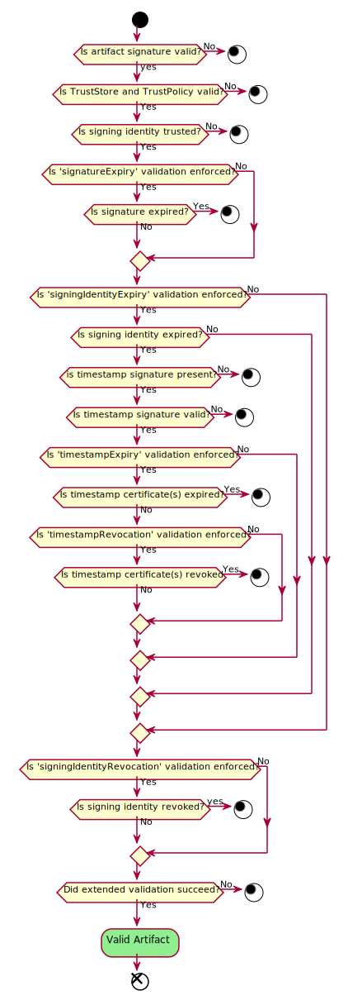

# Trust Store and Trust Policy Specification

This document describes how Notary v2 signatures are evaluated for trust. The document consists of following sections:

- **[Trust Store](#trust-store)**: Defines set of signing identity that user trusts.
- **[Trust Policy](#trust-policy)**: Defines how the artifact is evaluated for trust.

## Trust Store

Users who consume and execute the signed artifact from a registry need a mechanism to specify the trusted producers. This is where Trust Store is used.

Trust store allows users to specify two kinds of identities:

- **Certificates**: These are the signing certificates or certificates that chains to root CA.
- **Timestamping Certificates**: These are the timestamping certificates or certificates that chain to the root certificate of TSA.

The trust store is represented as JSON data structure as shown below:

```json
{
    "version": "1.0",
    "trustStores": {
        "trust-store-name-1": {
            "identities": {
                "x509Certs": [
                    "-----BEGIN CERTIFICATE-----\ncertificate1\n-----END CERTIFICATE-----\n",
                    "-----BEGIN CERTIFICATE-----\ncertificate2\n----END CERTIFICATE-----\n"
                ],
                "tsaX509Certs": [
                    "-----BEGIN CERTIFICATE-----\ntsaCertificate1\n-----END CERTIFICATE-----\n",
                    "-----BEGIN CERTIFICATE-----\ntsaCertificate2\n-----END CERTIFICATE-----\n"
                ]
            }
        },
        "trust-store-name-2": {
            "identities": {
                "x509Certs": [
                    "-----BEGIN CERTIFICATE-----\ncertificate1\n-----END CERTIFICATE-----\n",
                    "-----BEGIN CERTIFICATE-----\ncertificate2\n----END CERTIFICATE-----\n"
                ],
                "tsaX509Certs": [
                    "-----BEGIN CERTIFICATE-----\ntsaCertificate2\n-----END CERTIFICATE-----\n",
                    "-----BEGIN CERTIFICATE-----\ntsaCertificate3\n----END CERTIFICATE-----\n"
                ]
            }
        }
    }
}
```

Property Description:

- **`version`**(*string*): This REQUIRED property is the version of the trust store. The supported value is `1.0`
- **`trustStores`**(*object*): This REQUIRED property represents the parent node containing multiple trust stores. Each trust store is identified by the key associated with it like 'trust-store-name-1', 'trust-store-name-2'.
  - **`identities`**(*object*): This REQUIRED property represents the collection of different types of identities. There are two types of identifies that Notary v2 supports: x509 certificates and x509 timestamping certificates.
    - **`x509Certs`**(*array of strings*): This REQUIRED property specifies a list of x509 certificates in PEM format. The collection MUST contain at least one certificate.
    - **`tsaX509Certs`**(*array of strings*): This OPTIONAL property specifies a list of x509 timestamping certificates in PEM format. If the `tsaX509Certs` key is present then collection MUST contain at least one timestamping certificate.

## Trust Policy

Users who consume and execute the signed artifact from a registry need a mechanism to specify how the artifacts should be evaluated for trust, this is where a trust policy is used.
Trust policy allows users to control the artifact's integrity, expiry, and revocation aspect of signature evaluation.

### Artifact Integrity

The presence of a trust policy indicates that implementation MUST validate that artifact is signed and has not been altered.

### Artifact Expiry

Trust policy allows users to define how the system should behave when the artifact's signature is expired or signing identity is expired or timestamping identity is expired.

If artifact expiry validations are enforced the implementation MUST perform the following validations:

1. If signature expiry is present then signature MUST NOT be expired.
1. If signing identity is certificate and
    1. signing certificate and certificate chain are not expired then the implementation MUST ignore the timestamping signature even if it is present in the signature.
    1. signing certificate or certificate chain are expired then the implementation MUST validate that signature is timestamped and timestamping signature is valid. Also, validate that timestamping certificate and certificate chain MUST NOT be expired.

### Artifact Revocation

Trust policy also allows users to control how the system should behave when signing identity or  timestamping identity is revoked

If revocation validations are enforced implementation MUST perform the following validations:

1. If signing identity is a certificate
   1. then signing certificate and certificate-chain MUST NOT be revoked.
   1. and if the signing certificate and certificate chain are not expired then the implementation MUST ignore the revocation check for timestamping signature even if it's present in the signature.
   1. and if the signing certificate and certificate chain is expired then the implementation MUST validate that signature is timestamped and timestamping signature is valid. Also, validate that timestamping certificate and certificate chain MUST NOT be revoked.

The implementation MUST support both [OCSP](https://datatracker.ietf.org/doc/html/rfc6960) and [CRL](https://datatracker.ietf.org/doc/html/rfc5280) based revocations. Since revocation check requires network call and network call can fail because of a variety of reasons such as revocation endpoint is unavailable, network connectivity issue, DDoS attack, etc the implementation MUST support both `fail-open` or `fail-close` use cases.

- `fail-open`: If revocation endpoint is not reachable, consider artifact as revoked.
- `fail-close`: If revocation endpoint is not reachable, consider artifact as not revoked.

The trust policy is represented as JSON data structure as shown below:

```json
{
    "version": "1.0",
    "trustPolicies": [
        {
            "name": "trust-policy-name-1",
            "Scopes": ["wabbit-networks.io/software"],
            "trustStores": [ "trust-store-name-1", "trust-store-name-2" ],
            "expiryValidations": {
                "signatureExpiry": "enforce/warn",
                "signingIdentityExpiry": "enforce/warn",
                "timestampExpiry": "enforce/warn"
            },
            "revocationValidations": {
                "signingIdentityRevocation": "enforceWithFailOpen/enforceWithFailClose/warn/skip",
                "timestampRevocation": "enforceWithFailOpen/enforceWithFailClose/warn/skip"
            }
        },
        {
            "name": "trust-policy-name-2",
            "trustStores": [ "trust-store-name-1", "trust-store-name-2" ],
            "expiryValidations": {
                "signatureExpiry": "enforce/warn",
                "signingIdentityExpiry": "enforce/warn",
                "timestampExpiry": "enforce/warn"
            },
            "revocationValidations": {
                "signingIdentityRevocation": "enforceWithFailOpen/enforceWithFailClose/warn/skip",
                "timestampRevocation": "enforceWithFailOpen/enforceWithFailClose/warn/skip"
            }
        }

    ]
}
```

Property descriptions

- **`version`**(*string*): This REQUIRED property is the version of the trust policy. The supported value is `1.0`.
- **`trustPolicies`**(*string-array of objects map*): This REQUIRED property represents a collection of trust policies.
  - **`name`**(*string*): The name of the trust policy.
  - **`scope`**(*array of string*): The scope determines which trust policy is applicable for a given artifact. The scope field supports array of prefix-based filtering on registry-name/namespace+repository-name. For an artifact, if there is no applicable trust policy, then signature evaluation must be skipped.
  Please see [Scope Constraints](#scope_constraints) for more details.
  - **`trustStores`**(*array of strings*): This REQUIRED property specifies a list of names of trust stores that the user trusts.
  - **`expiryValidations`**(*object*): This REQUIRED property represents a collection of artifact expiry-related validations.
  - **`signatureExpiry`**(*string*): This REQUIRED property specifies what implementation must do if the signature is expired.  Supported values are `enforce` and `warn`.
    - **`signingIdentityExpiry`**(*string*): This REQUIRED property specifies what implementation must do if signing identity(certificate and certificate-chain) is expired. Supported values are `enforce` and `warn`.
    - **`timestampExpiry`**(*string*): This REQUIRED property specifies what implementation must do if timestamping certificate and certificate-chain are expired. Supported values are `enforce` and `warn`.
  - **`revocationValidations`**(*object*): This REQUIRED property represents collection of artifact revocation related validations.
    - **`signingIdentityRevocation`**(*string*): This REQUIRED property specifies whether implementation should check for signing identity(certificate and certificate-chain) revocation status or not and what implementation must do if this revocation check fails. Supported values are `enforceWithFailOpen`, `enforceWithFailClose`, `warn` and `skip`.
    - **`timestampRevocation`**(*string*): This REQUIRED property specifies whether implementation should check for timestamping certificate and certificate-chain revocation status or not and what implementation must do if this revocation check fails. Supported values are `enforceWithFailOpen`, `enforceWithFailClose`, `warn` and `skip`.

Value descriptions

- **`enforce`**: This means implementation MUST perform validation and throw an error if validation fails.
- **`enforceWithFailOpen`**: This means implementation MUST perform validation and if validation fails because the endpoint is not reachable, the implementation MUST throw an error and MUST fail the validation.
- **`enforceWithFailClose`**: This means implementation MUST perform validation and if validation fails because the endpoint is not reachable, the implementation MUST log an error and MUST NOT fail the validation.
- **`warn`**: This means implementation MUST perform the validation and if validation fails(because of any reason) the implementation MUST log an error and MUST NOT fail validation.
- **`skip`**: This means implementation MUST NOT perform the validation.

#### Scope Constraints

- There MUST NOT be two trust policies with the same scope.
- There MUST be only one trust policy applicable to an artifact. In the case of overlapping scopes, the longest prefix match rule is used.  For example, the `wabbit-networks.io/software/dotnet/ocp-release` image if there are two trust policies with overlapping scopes `registry.wabbit-networks.io/software` and `registry.wabbit-networks.io/software/dotnet` then the policy with the longest-prefix matching scope i.e. `registry.wabbit-networks.io/software/dotnet` will be used for signature evaluation.
- There MUST only be only one trust policy without the `scope` key, which means that the trust policy has global scope(applicable to all artifacts). The trust policy without the `scope` key is optional.

### Extended Validation

The implementation must allow the user to execute custom validations. These custom validation MUST have access to all the information available in the signature envelope like payload, signed attributes, unsigned attributes, and signature.

## Signature Evaluation

Precondition: The artifact is signed, trust store and trust policies are present.

1. Get the signing algorithm(hash+encryption) from the signing identity and validate that the signing algorithm is valid and allow-listed.
1. Get the public key from the signing identity and validate the artifact integrity using the public key and signing algorithm identified in the previous step.
1. Get and validate TrustStore and TrustPolicy for correctness.
1. Find the trust policy that is applicable for the given artifact. If there is no applicable trust policy, then the signature evaluation must be skipped.
1. Get the signing identity from the signed artifact and validate it against the identities configured in the trust store of trust policy determined in step 4. The signing identity must match or lead to at least one of the trusted identities configured in the trust store.
    1. If signing identity is certificate then validate that the certificate and certificate-chain leads to self-signed root.
1. Perform [artifact expiry](#artifact-expiry) validations based on trust policy.
1. Perform [artifact revocation](#artifact-revocation) validations based on trust policy
1. Perform extended validation(If any).

Here is high level uml diagram for signature evaluation:



## FAQ

**Q1.** How should multiple signatures requirements be represented in the trust policy?

We don't support n out m signature requirement verification scheme. Validation succeeds if verification succeeds for at least one signature.

**Q2.** Should local revocation and TSA servers are listed in the trust policy to support disconnected environments?

Not natively supported but a user can configure `revocationValidations` to `skip` and then use extended validations to check for revocation.

**Q3.** Why do we need to include a complete certificate chain(leading to root) in the signature?

Without a complete certificate chain, the implementation won't be able to perform an exhaustive revocation check, which will lead to security issues, and that's the reason for enforcing a complete certificate chain.

**Q4.** Why are we validating artifact signature first instead of signing identity?

Ideally, we should validate the signing identity first and then use the public key in the signing identity to validate the artifact signature. However, this will lead to poor performance in the case where the signature is not valid as there are lots of validations against the signing identity including network calls for revocations, and possibly we won't even need to read the trust store/trust policy if the signature validation fails.
Also, by validating artifact signature first we will still fail the validation if the signing identity is not trusted.
