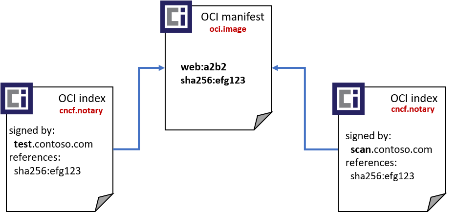
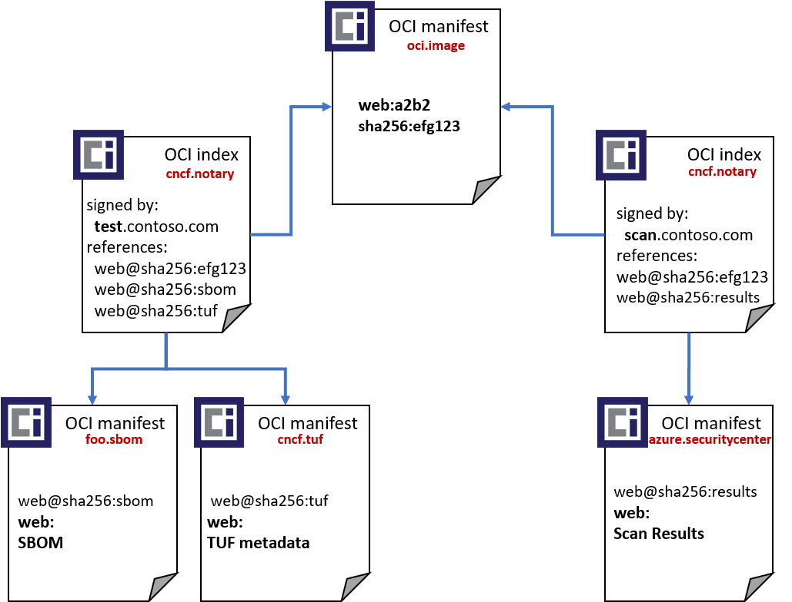

# Notary v2 - Verification  by Reference

5/1/2020
[Steve Lasker](https://github.com/SteveLasker)

## Overview

One of the many questions of Notary v2 is how will verification (signatures) be persisted within a registry. This paper outlines an option for persisting verification content as additional artifacts in the registry, with a reverse lookup. This would enable multiple verifications to exist without changing the original artifact, or the digest of the original content.

## Terms & references

For the purposes of this document, we defer what a verification means. A verification may be a signature, where an org, company or entity states it attests to the current state of an artifact. Or a larger verification document that has additional content to prove verification of an artifact. This doc experiments with the avoidance of signatures as the reference.

## Goals

1. An artifact and it’s digest shall not change as the result of a verification object being added.
1. Verification steps along a workflow must not be required to change how they reference the target artifact. A kube deployment yaml, helm chart, or docker compose file must not be required to change their tag reference of ubuntu:1404 or ubuntu@sha256:2468 digest reference.
1. A collection of verification objects may be associated with an artifact.
1. Leverage the garbage collection infrastructure registry operators have implemented. 
Garbage collection represents significant investments for registry services which are based on OCI Manifest and OCI Index. We should aim to utilize these existing schemas, or only slight verifications from them to maximize the opportunity for registry implementations to adopt Notary v2.
1. Minimize requirements to change persistence and object stores used by registry operators. Similar to garbage collection, we should work within the constraints of manifest, index and layers to represent verification objects.

## Non-goals

1. Work within the constraints of the existing OCI-distribution spec api set. 
Supporting Notary v1, or Docker Content Trust, requires new APIs. APIs are comparatively cheap to implement atop the persistence stores of registries. 
New APIs should be part of the Notary v2 spec, which may represent changes to the OCI-distribution spec or implementations of a new extension model over the Distribution spec.
1. Compatibility with Notary v1. Registries that have implemented Notary v1 are looking for a better solution. We cumulatively have little existing usage, and if successful, we expect all customers would rapidly move to Notary v2 eliminating the need to maintain two sets of APIs for an extended period of time.

## Adding verifications along a workflow

To address [Notary v2 Scenario #6: Multiple Signatures](https://github.com/notaryproject/requirements/blob/master/scenarios.md#scenario-6-multiple-signatures), an artifact must be capable of having additional signatures (verifications) be added. However, a deployment document (Helm chart, Kube deploy yaml) must not be required to change. 

1. A dev team builds a container image. `(web:a2b2)` They sign the image (provide verification).
1. An artifact scanning solution validates the image, storing an assessment of the current state of known vulnerabilities. It pushes a verification object for `web:a2b2`, stating on May 1, 2020, it was verified.
1. A test environment validates the image, it passes a set of tests and the image is promoted to staging. The image has a test verification added to the image. However, the deployment document doesn’t change the reference. It’s still referenced as web:a2b2. The additional verification document is associated with the image.
1. A staging environment is requested to run the web:a2b2 image, but requires scanning verification and test verification before the image can be run. 
As the artifacts are approved in staging, another verification object is pushed to the registry, attesting to the images and the deployment documents have passed all tests, as of a given date.
1. As the collection of artifacts are moved to production, a deployment policy verifies each artifact being requested for deployment has Staging, Test and Scanning verifications. The scanning verification must be within a given date range. Each verification must come from entities the production system trusts. 

## Verification by downward reference

The OCI distribution and image specs utilize OCI manifest and OCI index. These are json documents that provide downward references. 

1. An OCI index references a collection of other OCI indexes and/or OCI manifests by their digest.

    ```json
    {
      "schemaVersion": 2,
      "manifests": [
        {
          "mediaType": "application/vnd.oci.image.manifest.v1+json",
          "size": 7143,
          "digest": "sha256:e692418e4cbaf90ca69d05a66403747baa33ee08806650b51fab815ad",
          "platform": {
            "architecture": "ppc64le",
            "os": "linux"
          }
        },
        {
          "mediaType": "application/vnd.oci.image.manifest.v1+json",
          "size": 7682,
          "digest": "sha256:5b0bcabd1ed22e9fb1310cf6c2dec7cdef19f0ad69efa1f392e94a433",
          "platform": {
            "architecture": "amd64",
            "os": "linux"
          }
        }
      ]
    }
    ```

1. An OCI manifest references a collection of layers, by their digest.

    ```json
    {
      "schemaVersion": 2,
      "config": {
        "mediaType": "application/vnd.oci.image.config.v1+json",
        "size": 7023,
        "digest": "sha256:b5b2b2c507a0944348e0303114d8d93aaaa081732b86451d9bce1f432a5"
      },
      "layers": [
        {
          "mediaType": "application/vnd.oci.image.layer.v1.tar+gzip",
          "size": 32654,
          "digest": "sha256:9834876dcfb05cb167a5c24953eba58c4ac89b1adf57f28f2f9d09af1"
        },
        {
          "mediaType": "application/vnd.oci.image.layer.v1.tar+gzip",
          "size": 16724,
          "digest": "sha256:3c3a4604a545cdc127456d94e421cd355bca5b528f4a9c1905b15da2s"
        }
      ]
    }
    ```

We have been largely focusing on the need to support this downward reference model. Some suggestions have focused on using the OCI index to add content, where a new OCI index is the new reference. This implies the user must change the reference to the web:a2b2 image they intend to deploy.

## OCI index, downward reference of manifest

Based on [requirements/pull/6](https://github.com/notaryproject/requirements/pull/6) from Sam

### `web:a2b2` image with oci manifest

The artifact can be pulled as `registry.contoso.com/marketing/web:a2b2`

```json
{
  "schemaVersion": 2,
  "config": {
    "mediaType": "application/vnd.oci.image.config.v1+json",
    "size": 7023,
    "digest": "sha256:b5b2b2c507a0944348e0303114d8d93aaaa081732b86451d9"
  },
  "layers": [
    {
      "mediaType": "application/vnd.oci.image.layer.v1.tar+gzip",
      "size": 32654,
      "digest": "sha256:9834876dcfb05cb167a5c24953eba58c4ac89b1adf57f28"
    },
    {
      "mediaType": "application/vnd.oci.image.layer.v1.tar+gzip",
      "size": 16724,
      "digest": "sha256:3c3a4604a545cdc127456d94e421cd355bca5b528f4a9c1"
    }
  ]
}
```

### `web:a2b2` signature with oci index:

When signing an existing artifact with this model, a new index would either need to be pushed, redirecting the web:a2b2 tag to the new index, or the deployment would have to change to a new tag associated with the new index.

`registry.contoso.com/marketing/web:a2b2-verification`

```json
{
  "schemaVersion": 2,
  "manifests": [
    {
      "mediaType": "application/vnd.oci.image.config.v1+json",
      "size": 7023,
      "digest": "sha256:b5b2b2c507a0944348e0303114d8d93aaaa081732b864",
      "signatures": [
        {
          "mediaType": "applicaiton/vnd.cncf.notary.x509-signature.config.v2",
          "digest": "sha256:134c7fe821b9d359490cd009ce7ca322453f4f2d0",
          "size": 1337,
          "annotations": {
            "org.opencontainers.image.signature.fingerprint": "43:51:43:a1:b5:fc:8b:b7:0a:3a:a9:b1:0f:66:73:a8"
          }
        }
      ]
    }
  ]
}
```

One challenge with this downward dependency approach is existing deployment documents which reference the original tag (`registry.contoso.com/marketing/web:a2b2`) and/or digest would need to change to the signed index reference (`registry.contoso.com/marketing/web:a2b2-verification`). This puts a new burden on a team that must change the references because another system may require a specific verification.

Updating the existing tag could cause inconsistencies as some verification systems track the digest associated with a tag, and also limits new signatures from being pushed, without having to update the same index.

## Reverse lookup

**What if** we supported a reverse lookup, where a client can ask for all the verification objects for a given artifact? Reverse lookup refers to the ability to find which manifests are referenced by index objects.



We could still use the oci index schema with two changes:

1. Index is versioned to include `index.config` (artifactType in red)
1. Add a new notary API that finds all indexes, with `"index.config.mediaType": "application/vnd.cncf.notary.verification.v1.config.json"`

### web:a2b2 image as an OCI Manifest

Same as above.

```json
{
  "schemaVersion": 2,
  "config": {
    "mediaType": "application/vnd.oci.image.config.v1+json",
    "size": 7023,
    "digest": "sha256:b5b2b2c507a0944348e0303114d8d93aaaa081732b86451d9"
  },
  "layers": [
    {
      "mediaType": "application/vnd.oci.image.layer.v1.tar+gzip",
      "size": 32654,
      "digest": "sha256:9834876dcfb05cb167a5c24953eba58c4ac89b1adf57f28"
    },
    {
      "mediaType": "application/vnd.oci.image.layer.v1.tar+gzip",
      "size": 16724,
      "digest": "sha256:3c3a4604a545cdc127456d94e421cd355bca5b528f4a9c1"
    }
  ]
}
```

### web:a2b2 staging verification w/ index

An index is pushed that supports `index.config`, which tells the registry this index is a type of Notary Verification. This follows the same pattern we use with [OCI Artifacts to identify oci manifest as specific type](https://github.com/opencontainers/artifacts/blob/master/artifact-authors.md#defining-oci-artifact-types).
This index would NOT be pushed with a tag. It would be a digest only reference. 

```json
{
  "schemaVersion": 2.1,
  "config": {
      "mediaType": "application/vnd.cncf.notary.verification.config.v1+json",
      "size": 7023,
      "digest": "sha256:b5b2b2c507a0944348e0303114d8d93aaaa081732b8645"
    },
    "manifests": [
    {
      "mediaType": "application/vnd.oci.image.manifest.v1+json",
      "size": 7023,
      "digest": "sha256:b5b2b2c507a0944348e0303114d8d93aaaa081732b864",
      "platform": {
        "architecture": "ppc64le",
        "os": "linux"
      }
    }
  ]
}
```

### web:a2b2 staging verification-config

The fingerprint, or any other verification content, could be placed in the index.config object, leveraging the config object pattern, without depending on loosely defined annotations.

```json
{
  "issuedTo": "staging.contoso.com",
  "issuedBy": "DigCerti SHA2 Extended Validation Server CA",
  "validFrom": "5/7/2018",
  "validTo": "6/3/2020",
  "x509-fingerprint": "43:51:43:a1:b5:fc:8b:b7:0a:3a:a9:b1:0f:66:73:a8"
}
```

### web:a2b2 scanning verification w/ index

Another index of type `notary.verification`, which adds the scanning verification.

```json
{
  "schemaVersion": 2.1,
  "config": {
    "mediaType": "application/vnd.cncf.notary.verification.config.v1+json",
    "size": 7023,
    "digest": "sha256:a6a2b2c507a0944348e0303114d8d93aaaa081732b86451d9"
  },
  "manifests": [
    {
      "mediaType": "application/vnd.oci.image.manifest.v1+json",
      "size": 7023,
      "digest": "sha256:b5b2b2c507a0944348e0303114d8d93aaaa081732b86451",
      "platform": {
        "architecture": "ppc64le",
        "os": "linux"
      }
    }
  ]
}
```

### web:a2b2 scanning verification-config

```json
{
  "issuedTo": "*.scan.contoso.com",
  "issuedBy": "DigCerti SHA2 Extended Validation Server CA",
  "validFrom": "5/7/2018",
  "validTo": "6/3/2020",
  "x509-fingerprint": "86:75:30:90:b5:fc:8b:b7:0a:3a:a9:13:12:55:62:b8"
}
```

The nv2 client could retrieve all signatures with the following mocked command

```shell
nv2 verification pull registry.contoso.com/marketing/web:a2b2
nv2 verification pull registry.contoso.com/marketing/web@256:efg123
```

or

```shell
nv2 verify registry.contoso.com/marketing/web:a2b2
nv2 verify registry.contoso.com/marketing/web@256:efg123
```

The `nv2 verify` API compares the artifact with local configuration to attest to it matching the configured rules. These could include the artifact has required verifications for Scanning and Testing verification.

## Pros & Cons

The pros of this approach are:

- Multiple signatures may be added without changing the original artifact digest as no content changes are made to the digest, or even annotations
- All deployment references remain: web:a2b2 and it’s associated digest do not change.

The cons of this approach:

- A new API must be added. We’ve said this was within scope and ok as registries must add Notary v1, Content Trust to support existing scenarios. Since most registries need to do some work, adding a new API is not a stretch
- Reverse lookup, and its impact on garbage collection. Registries tend to traverse down. If multiple manifests reference common base layers, the registry knows to reference count shared layers and only deletes the layers once all manifests are removed. Orphaned manifests may be deleted if they’re no longer referenced by tags.  
Most importantly, a manifest is likely blocked from deletion if it’s referenced by an index. In this reverse lookup model, the user likely wants all verifications to be deleted when the artifact is deleted. This isn’t necessarily an immediate blocker, but it does go against the garbage collection constraint outlined above.
This is work registry operators must implement so users don’t have to change their artifact references? Is this the right trade-off?

## Verifications with Additional Content

We’ve debated whether a signature is the verification, or something more must be provided. For instance, should some TUF metadata or an SBoM be required as well?
The reverse lookup index could be expanded as follows:



The user still references `registry.contoso.com/web:a2b2`, while other parts of the system that adhere to notary v2 would know to query the registry for the additional verification information.

An nv2 client queries for all indexes with a `"config.mediaType"` of `"application/vnd.cncf.notary.verification.config.v1+json"` It would read all the verification objects and decide how to proceed.

For customers that aren’t comfortable with tags, you could query for the digest of `web:a2b2`. It would return the same list of verification objects.

```bash
nv2 verify registry.contoso.com/web@sha256:efg123
```

The SBOM client would know to parse the index and pull any manifests with a `"config.mediaType"` of `"application/foo.sbom.config.v1+json"`.
The tuf enabled client would know to pull a `"config.mediaType"` of `"application/cncf.tuf.config.v1+json"`
A cloud specific extension would know to pull a `"config.mediaType"` of `"application/azure.securitycenter.config.v1+json"` verifying it was recently scanned before proceeding. If the scan was too old, it may block deployment while a new scan is achieved, or enable deployment with a scan occurring concurrently.

